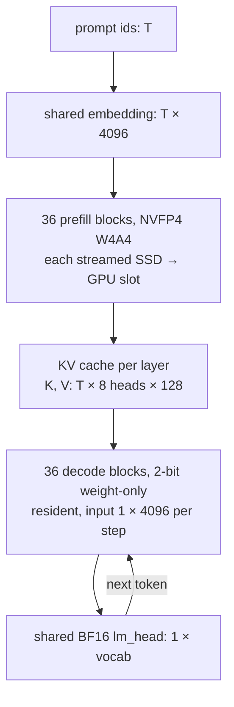

## Part I: Why should I care? { .rd-part }

## ⚡ The hook { #hook }

Someone on the internet has squeezed Qwen3.8-27B down to about 1 bit per weight (the Unsloth `IQ1_S` GGUF) so it fits on a small GPU. It runs, but it's badly damaged: **29.0%** on MMLU-Pro, against **84.6%** for the full-precision model (Table 5).

Now leave those 1-bit weights alone. Train a *second* copy of the linear layers in 4-bit NVFP4 whose only job is to read the prompt, and keep that copy on the SSD instead of the GPU. The same 1-bit decoder now scores **61.5%** on MMLU-Pro and **59.7%** on image questions (MMMU-Pro), up from 24.4%, even though the extra training was text only (Table 5, §3.2). At an 8K-token prompt, time to first token drops from **12.27 s to 6.90 s** (§3.2). GPU weight memory doesn't grow.

How can a better *prompt reader* rescue a broken *answer writer*, and how can extra weights cost no GPU memory? By the end of this page you'll be able to explain both, rebuild the core trick in 60 lines of PyTorch, and say where it breaks.

## ⚡ The paper in one picture { #one-picture }

**One sentence.** Reading the prompt is compute-bound and writing the answer is memory-bound, so give each phase its own quantization format (and, if you can store it, its own weights), trained together through the KV cache so the answer stays right.

**One paragraph.** An LLM answers a question in two phases. *Prefill* pushes the whole prompt through the network in one go and leaves behind a KV cache. *Decode* then produces the answer one token at a time, reading that cache. Prefill is limited by arithmetic, so it wants fast low-precision math (4-bit weights **and** 4-bit activations). Decode is limited by how many bytes of weights it drags from memory per token, so it wants the tiniest possible weights and has no need to quantize activations. Disaggregated quantization (DQ) stops forcing one format on both. In its strongest form, prefill gets its own NVFP4 weights, decode keeps a 2-bit (or 1-bit) copy, and a training method called QADD optimizes both so that the *answer* matches a full-precision teacher. Since prefill weights are only needed while the prompt is being read, they can be streamed from SSD block by block (ODP).

<figure class="rd-fig" markdown>
--8<-- "papers/2609.26333-disaggregated-quantization/assets/one-picture.svg"
<figcaption><strong>What to notice:</strong> the two halves only meet at the KV cache, which keeps the original model's shape. The dashed violet arrow is why this works: the loss is computed only on the answer, but its gradient flows back through the cache into the prefill weights, so the reader learns to write whatever the damaged writer needs.</figcaption>
</figure>

## Primer: what you need first { #primer }

??? deep "Open the primer (skip if you ticked every prerequisite)"

    ### Prefill, decode and the KV cache { #primer-prefill-decode }

    A decoder-only LLM predicts each token from all the tokens before it. At inference that splits into two phases (§1):

    - **Prefill.** The whole prompt (say 8,000 tokens) goes through every layer *in parallel*, like a training forward pass. Each attention layer stores the keys and values it computed for every prompt token. That store is the **KV cache**.
    - **Decode.** The model generates the answer one token per step. Each new token runs through every layer alone (a sequence length of 1), attends to the cached keys and values, and appends its own.

    The cache is the only thing decode needs from prefill. That makes it a clean interface, which is why big deployments already run prefill and decode on **different GPUs** ("disaggregated serving") and ship the cache between them (§1.1).

    For a feel of the size: Qwen3-8B has 36 layers (Table 6) and, per its public config (found by us), 8 KV heads of dimension 128. A 16K-token prompt therefore leaves \(16384 \times 36 \times 2 \times 8 \times 128 \approx 1.2\)B cached numbers, about 2.4 GB in BF16.

    !!! bridge "Speech bridge: Whisper's encoder and decoder"
        You already know a model with two phases: Whisper's encoder crunches all 1,500 audio frames at once (compute-heavy, parallel), and its decoder emits text tokens one by one while cross-attending to the encoder output. Prefill is the "encoder" of a decoder-only LLM, and the KV cache plays the role of the encoder output.

        **Where it breaks:** Whisper's encoder and decoder are *different networks* trained as such. In a decoder-only LLM, prefill and decode run the **same** weights; the split only exists at inference time, and the "interface" is self-attention K/V at every layer, not one cross-attention memory. DQ's move is to split the weights again, encoder–decoder style, which is exactly how §1 frames it.

    ### Compute-bound vs memory-bound { #primer-bound }

    Every linear layer does two things: it **moves** weights and activations from memory into the compute units, and it **multiplies** them. For an \(H \times H\) weight and \(T\) tokens, it moves about \(H^2 + TH\) numbers and does about \(TH^2\) multiply-adds (§1.1). The ratio, **arithmetic intensity**, is roughly \(T\) when \(T \ll H\).

    Plug in \(H = 4096\) (Qwen3-8B's width, Table 6), BF16:

    <figure class="rd-fig" markdown>
    --8<-- "papers/2609.26333-disaggregated-quantization/assets/intensity.svg"
    <figcaption><strong>What to notice:</strong> the same layer is at opposite ends of the scale. Decode moves 33.6 MB of weights to do about 1 FLOP per byte, so the compute units starve. Prefill at 16K tokens does about 1,800 FLOPs per byte, so memory is no longer the limit. (Our arithmetic from the paper's cost formula in §1.1; activations counted in and out at 2 bytes each.)</figcaption>
    </figure>

    A GPU needs a certain number of FLOPs per byte to stay busy. We don't have the paper's figure for its hardware; as an order of magnitude (🧠), modern accelerators need a few hundred. Decode sits far below that line, so **fewer weight bytes = faster decode**. Prefill sits far above it, so **faster arithmetic = faster prefill**, and shrinking weights barely helps.

    ### Quantization formats: W4A16, W4A4, NVFP4, GGUF { #primer-formats }

    Quantizing means storing a number with fewer bits by snapping it to a small grid. The notation **W*x*A*y*** says weights use *x* bits and activations *y*.

    - **Weight-only (W4A16, W2A16...).** Weights are stored compressed; the kernel decompresses them on the fly and multiplies with ordinary BF16 activations. Great for decode (fewer bytes), useless for prefill speed: the math is still BF16. The encoding can be anything, even an exotic codebook, because software decodes it (§1.1).
    - **Weight + activation (W4A4).** Both operands are 4-bit and the GPU's tensor cores multiply them natively. This speeds up compute-bound prefill, but only works with formats the **hardware** supports, and quantizing activations adds error.
    - **NVFP4** is NVIDIA's 4-bit float for Blackwell GPUs. Each value is E2M1: a sign plus one of the magnitudes {0, 0.5, 1, 1.5, 2, 3, 4, 6}. Values come in **blocks of 16**, each block has an FP8 scale, and the whole tensor has one FP32 scale (App. A.3). **NVFP4A16** means NVFP4 weights with BF16 activations, i.e. weight-only.
    - **LUT2 / LUT3** are this paper's 2- and 3-bit weight-only formats: the same block scaling, but values snap to a small look-up table (grid) tuned for Gaussian-shaped weights (App. A.3). The GPU can't multiply them natively.
    - **GGUF** is llama.cpp's file format. Names like `IQ1_S`, `IQ2_XXS`, `Q3_K_XL` are its weight-only schemes, from about 1 to 3 bits; the IQ ones use vector-quantized codebooks (§3.2).

    <figure class="rd-fig" markdown>
    --8<-- "papers/2609.26333-disaggregated-quantization/assets/grids.svg"
    <figcaption><strong>What to notice:</strong> how few places a 2-bit weight can land. LUT2 has only four values, and its asymmetry is deliberate: the block scale absorbs the sign so each block's largest-magnitude element always maps to exactly +6. (Grid values from App. A.3.)</figcaption>
    </figure>

    ### Quantization-aware distillation and the STE { #primer-qad }

    **Post-training quantization (PTQ)** rounds a trained model's weights and hopes for the best. **Quantization-aware training** keeps full-precision "master" weights, runs the forward pass with their *quantized* version, and updates the masters with the gradients. Rounding has zero gradient almost everywhere, so you use the **straight-through estimator (STE)**: forward with the rounded value, backward as if rounding were the identity. In PyTorch that's one line, `w + (q - w).detach()` (App. A.1).

    **Quantization-aware distillation (QAD)** swaps the usual next-token loss for matching a frozen full-precision **teacher**: minimize \(\mathrm{KL}(p_{\text{teacher}} \,\|\, p_{\text{student}})\) over the vocabulary at each scored position (§3.1). The student learns the teacher's whole distribution, not just its top token.

    !!! bridge "Speech bridge: distilling a big ASR model into a small one"
        This is the same recipe as distilling a large Whisper into a small on-device student with a KL on per-token distributions. **Where it breaks:** here teacher and student have *identical* architecture and start from the same weights; the student only differs by being rounded. The goal is to recover what rounding broke, not to transfer knowledge into a smaller network.

## The problem { #problem }

Today, a quantized model uses **one format for both phases**, which forces a bad trade.

Pick a W4A4 format like NVFP4 and prefill gets up to 1.49× faster on Qwen3-8B (Table 1), but the 4-bit activations also hit decode, where they save little (decode is memory-bound anyway) and cost accuracy on every generated token. Pick a weight-only format and decode is small and accurate, but prefill runs at plain BF16 speed.

It gets worse at 2–3 bits, which is where the best size-to-accuracy trade-offs live (§2.3). Those compact encodings aren't hardware compute formats. To use tensor cores anyway you must "autocast": re-quantize the 2-bit weights into NVFP4 on the fly, and quantize activations too. Now prefill runs on a doubly-rounded weight, and decode pays for all of it.

Here are the costs on the Qwen 3 family, averaged over 0.6B–8B (Table 1):

| 2-bit weights, used as... | Prefill speedup | Decode-heavy acc. | Prefill-heavy acc. |
|---|---|---|---|
| weight-only both phases (W2A16) | 1.00× | 38.4 | 64.1 |
| autocast to NVFP4 both phases ("LUT2") | 1.49× | 34.8 | 61.3 |
| BF16 reference | 1.00× | 66.2 | 84.2 |

Faster prefill costs 3.6 points of reasoning accuracy, and neither row is anywhere near BF16.

!!! paper "The paper's framing (§1, §1.1)"
    Prefill and decode are different enough that large deployments already put them on separate accelerators with their own weights, exchanging only the KV cache. Existing work on that split mostly optimizes the cache's communication and scheduling. The paper argues the two phases can also use *different quantized representations* while being trained toward the same response.

!!! take "Our sharper version"
    Quantization research has quietly assumed that "the model" is one object with one format. Serving systems stopped believing that years ago. This paper applies the serving-systems view to the number format.

If we split the formats, how do we train two pathways that never see the same token, and what do we do with a second set of weights on a laptop-sized GPU?
{ .rd-next }

## Part II: What and how { .rd-part }

## ⚡ The big idea { #big-idea }

**Read fast, write small.** The prompt reader gets fast 4-bit arithmetic; the answer writer gets the smallest weights you can tolerate. They're allowed to disagree about everything except the KV cache, and they're trained *together*, so the answer is what gets optimized, not each half's rounding error.

The "aha" is in the training. In an SFT example, the label mask already marks which tokens are prompt (ignored by the loss) and which are answer (scored). QADD reuses that mask to **route** each token through the prefill or the decode pathway (§2.1). One forward–backward pass then trains both. The loss only looks at the answer, yet the prefill weights still learn, because every answer token attends to the keys and values that prefill wrote.

That opens the most surprising option: freeze someone else's decoder entirely, even a 1-bit GGUF, and train only a **prefiller** that writes a KV cache this particular broken decoder can use well (§2.6).

!!! predict "Pause and predict"
    You make decode weight-only (drop activation quantization at decode only) but keep the *same* weights and the NVFP4 prefill. Which benchmark type should gain more accuracy: long-answer reasoning (GSM8K, MATH) or long-prompt retrieval with 30–128-token answers (RULER)?

    ??? answer "Reveal"
        **Reasoning.** You only removed error from the decode phase, and reasoning tasks spend most of their tokens in decode. The paper sees exactly that: format disaggregation adds 1.9–4.5 points on decode-heavy tasks and changes prefill-heavy RULER by less than 1.3 points (§3.2). If you guessed RULER because "the prompt is long", note that the prompt still goes through the same NVFP4 prefill path as before.

## How it works { #how-it-works }

We'll build it up in four rungs. Each fixes something the previous one couldn't.

### ⚡ The core mechanism: a ladder of three splits { #ladder }

Everything happens inside each linear layer. The attention architecture and cache shape stay untouched (§2.4).

<figure class="rd-fig" markdown>
--8<-- "papers/2609.26333-disaggregated-quantization/assets/ladder.svg"
<figcaption><strong>What to notice:</strong> going down the ladder, the blue decode path gets rid of 4-bit activations (rung ②), then the amber prefill path gets rid of its dependence on the 2-bit weight (rung ③). Each rung removes one source of rounding error from one phase. (Our redraw of the idea in the paper's Fig. 2.)</figcaption>
</figure>

1. **Non-disaggregated (the baseline).** One weight and one path for both phases. With 2-bit LUT weights, "autocast" re-quantizes them to NVFP4 and quantizes activations everywhere (§2.3). Fast prefill, but decode carries needless error.
2. **Format-disaggregated.** Same single weight, same storage. Prefill keeps the fast NVFP4 path, while decode skips the re-quantization and activation quantization and multiplies the compact weight with BF16 activations. It's free: decode even gets 2–3% faster, because it skips the activation-quantize call (§3.2, App. C.2).
3. **Fully-disaggregated.** Prefill still sees a re-quantized *view* of a 2-bit weight, which throws away information it has no use for (§2.3). So give prefill **its own NVFP4 weights**, initialized from the same unquantized model and trained jointly (§2.4). You now store two checkpoints.
4. **ODP (offloaded disaggregated prefill).** The extra checkpoint is only needed while the prompt is read, so stream it from SSD one transformer block at a time, through two GPU buffers borrowed from decode weights that sit idle during prefill (§2.5). No extra GPU weight memory.

And a variant of rung 3: **prefillers** keep someone else's frozen decoder and train only the prefill copy (§2.6).

!!! paper "Speed and memory stay put (Table 1, §3.2)"
    On Qwen3-8B, format-disaggregated LUT2 keeps LUT2's 1.49× prefill and 4.66 GB device weights, and its decode speedup rises from 3.73× to 3.82× because decode skips activation quantization. Full disaggregation keeps the 3.82× decode but needs 8.57 GB resident. With ODP it drops back to 4.66 GB at 1.47× prefill (16K context).

### Data flow with shapes { #shapes }

For Qwen3-8B (\(d_{\text{model}} = 4096\), \(d_{\text{ffn}} = 12288\), 36 layers, Table 6; head counts from the public config, found by us) and a prompt of \(T\) tokens:

<figure class="rd-fig" markdown>



<figcaption><strong>What to notice:</strong> only the linear projections inside the blocks are duplicated. Embedding, output head and attention cache shape are shared, so decode can't tell which weights wrote the cache. (The lm_head stays unquantized in every format, App. A.3.)</figcaption>
</figure>

### Decoding the formats { #formats-math }

**Two-level block scaling** (App. A.3). A weight tensor \(W\) is cut into blocks of 16 along the input (contraction) dimension:

\[
s = \frac{\max |W|}{6 \cdot 448}, \qquad
b_j = \operatorname{e4m3}\!\left(\frac{\max_{i \in j} |W_i| / 6}{s}\right), \qquad
\hat W_i = g\!\left(\frac{W_i}{b_j\, s}\right) \cdot b_j\, s
\]

| Symbol | Meaning |
|---|---|
| \(s\) | one FP32 global scale per tensor; 6 is the grid maximum, 448 is FP8-E4M3's maximum |
| \(b_j\) | the FP8-E4M3 scale of block \(j\) (16 elements), chosen so the block's largest element lands near ±6 |
| \(g(\cdot)\) | round to the nearest grid point: E2M1 for NVFP4, the LUT tables for LUT2/LUT3 |
| \(\hat W_i\) | the dequantized value the matmul actually uses |

**In words:** divide each block by its own scale so its biggest element sits at the edge of the grid, snap to the grid, multiply back. The two levels exist because an FP8 scale alone has limited range, so the FP32 global scale puts all the block scales in range.

**Tiny example** (4 values instead of 16, global scale folded in): block = [0.12, −0.50, 0.33, 0.07].

- *NVFP4:* scale = 0.50/6 ≈ 0.0833. Normalized: [1.44, −6, 3.96, 0.84] → snap to E2M1: [1.5, −6, 4, 1] → back: **[0.125, −0.50, 0.333, 0.083]**. Close everywhere.
- *LUT2 (signed scale):* the largest-magnitude element is negative, so the scale absorbs the sign: −0.0833. Normalized: [−1.44, +6, −3.96, −0.84] → snap to {−3.65, 0, 2.52, 6}: [0, 6, −3.65, 0] → back: **[0, −0.50, 0.304, 0]**. Two of four weights vanish.

**Storage** (App. A.3): LUT\(b\) costs \(b + 0.5\) bits per weight (the FP8 scale per 16 elements adds 0.5), so LUT2 is 2.5 bits, LUT3 3.5, NVFP4 4.5, against 16 for BF16. At batch-1 decode that byte count is almost the whole cost (App. C.2).

??? deep "Deep dive: why the LUT grids look the way they do"
    The grids were fit to minimize expected squared error on \(\mathcal{N}(0,1)\) samples after the same block scaling, with two points pinned: 0 and +6 (App. A.3). In the repo, a comment in `grids.py` explains the pins (💻, [grids.py L48–L72](https://github.com/IST-DASLab/disaggregated-quantization/blob/4a99d6e02817a796bfe3f3d7a5edbf75aeb9f4ba/qad/quantizers/grids.py#L48-L72)): +6 makes each block's extreme element exact, and 0 gives a true flush-to-zero for the many near-zero weights. The comment measures the cost of pinning at a relative MSE of 0.0211 versus 0.0205 for the unconstrained 3-bit Lloyd grid. Lloyd's algorithm is 1-D k-means, which is why the code calls these formats `lloyd43` and `lloyd21`.

### QADD: one pass, two pathways { #qadd }

<figure class="rd-fig" markdown>
--8<-- "papers/2609.26333-disaggregated-quantization/assets/qadd.svg"
<figcaption><strong>What to notice:</strong> the thick-bordered "?" token. It runs through the <em>prefill</em> pathway but predicts the first answer token, so it's scored. That boundary position, plus every answer token's attention into the prompt K/V, is how prefill weights get gradient from an answer-only loss (App. A.1).</figcaption>
</figure>

The objective is ordinary distillation, restricted to answer targets (§3.1, App. A.1):

\[
\mathcal{L} = \frac{1}{|\mathcal{A}|} \sum_{t \in \mathcal{A}} \mathrm{KL}\big(p_{\text{teacher}}(\cdot \mid x_{\le t}) \,\big\|\, p_{\text{student}}(\cdot \mid x_{\le t};\, \theta_{\text{pre}}, \theta_{\text{dec}}, m)\big)
\]

| Symbol | Meaning |
|---|---|
| \(\mathcal{A}\) | positions whose *next* token is an answer token (causal shift), including the last prompt position |
| \(p_{\text{teacher}}\) | the frozen BF16 model's next-token distribution |
| \(\theta_{\text{pre}}, \theta_{\text{dec}}\) | prefill and decode weights; equal (shared master) for format disaggregation, separate for full disaggregation, \(\theta_{\text{dec}}\) frozen for prefillers |
| \(m\) | the per-token mask from the SFT labels: label = −100 → prefill pathway, else decode |

(The paper writes the objective only as \(\mathrm{KL}(p_{\text{teacher}}\|p_{\text{student}})\); the expanded form above is our notation for what §2.1 and App. A.1 describe.)

**In words:** run the student over the whole chat with each token in its phase's format, compare its answer-token distributions to the teacher's, and backpropagate into whichever weights are trainable.

**Tiny numeric example.** Vocabulary of 3. Teacher says \(p = [0.7, 0.2, 0.1]\) for the first answer token; the student says \(q = [0.5, 0.3, 0.2]\).
\(\mathrm{KL}(p\|q) = 0.7\ln\frac{0.7}{0.5} + 0.2\ln\frac{0.2}{0.3} + 0.1\ln\frac{0.1}{0.2} = 0.236 - 0.081 - 0.069 = 0.085\) nats. Only the prefill weights produced the hidden state at that position (it's the "?" position), so in a prefiller setup all of that gradient lands on \(\theta_{\text{pre}}\).

!!! predict "Pause and predict"
    During training, every token goes through the model in a single teacher-forced pass. At inference, prefill runs once and decode runs step by step. Why is training in one pass not cheating: why do the two compute the same thing?

    ??? answer "Reveal"
        Attention is causal and the routing is per position. A prompt position's K/V depend only on earlier prompt tokens, all processed by the prefill pathway, exactly as in real prefill. An answer position depends on the prompt K/V (prefill-made) and on earlier answer K/V (decode-made), exactly as in real decode. So the teacher-forced pass reproduces the inference-time cache token for token. The trap is thinking the decode pathway needs to run sequentially during training; it doesn't, just as a causal LM trains in parallel. (One real difference: multi-turn chats, where the paper flags that *previous* answers may be re-prefilled later, §5.)

**Pseudocode** (after App. A.1; the paper has no algorithm box):

```text
for batch (input_ids, labels) in SFT data:
    mask = (labels == -100)                  # True -> prefill pathway
    with teacher frozen:  t_logits = teacher(input_ids)
    s_logits = student(input_ids, route=mask) # each linear: where(mask, W4A4(x, W_pre), WeightOnly(x, W_dec))
    targets  = positions whose next label != -100
    loss = KL(softmax(t_logits[targets]) || softmax(s_logits[targets]))
    loss.backward()                          # STE through every rounding
    AdamW step on trainable masters (W_pre; W_dec unless frozen)
    re-quantize the cached quantized weights from the masters
```

**Inference:**

```text
prefill: for each block i:   [ODP] start loading block i+1 into the free slot
                             run block i on the prompt with W4A4 NVFP4 weights -> K_i, V_i
         [ODP] restore the decode weights that the two slots borrowed
decode:  repeat: run all resident weight-only blocks on 1 token, attend to K, V, sample
```

### ODP: why streaming weights can be free { #odp }

Prefill compute grows with prompt length, but loading the prefill checkpoint is a fixed cost, so the longer the prompt, the better it hides (§2.5). Two GPU buffers suffice: while block \(i\) computes, block \(i+1\) loads. Each block's time is roughly \(\max(\text{load}, \text{compute})\) (💻 the repo's benchmark states it exactly so, [`offload_forward.py`](https://github.com/IST-DASLab/disaggregated-quantization/blob/4a99d6e02817a796bfe3f3d7a5edbf75aeb9f4ba/qad/kernels/prefill/offload_forward.py#L1-L12)). The buffers are carved out of decode weights, which are idle during prefill, and restored before generation. That's why the device weight memory doesn't grow; the cost is extra SSD reads (§2.5).

<div class="rd-widget" id="dq-odp" role="group" aria-label="ODP latency explorer"><noscript>This widget needs JavaScript.</noscript></div>
<script src="assets/widget-odp.js"></script>
<p class="rd-widget-caption"><strong>Try this:</strong> drag the prompt to 1K and read the readout: the GPU waits on the SSD and ODP is slower than plain BF16. Then drag to 16K and watch the orange SSD bars fit inside the compute bars. Finally drop the SSD to 2 GB/s and see the crossover move right. <em>This is our cost model, not a measurement:</em> per-layer times from Table 11 (Qwen3-8B at 16K), scaled linearly for projections and quadratically for attention; 3.64 GB checkpoint + 0.20 GB carve-out from App. C.1; the 5.7 GB/s default comes from the repo's benchmark notes. It reproduces 1.45× at 16K (the paper measures 1.47×) but crosses over near 5K, where the paper's measured curve crosses near 8K (Fig. 6a), and it underestimates NVFP4 at 32K by about 11%.</p>

!!! paper "Measured (§3.2, Table 10)"
    Above 16K context, ODP adds under 5% to resident NVFP4 prefill latency on Qwen 3 and under 8% on Gemma 3; the overhead comes from the cold first block and synchronization. At 16K the streamed stack is still 1.47× faster than BF16 on Qwen3-8B and 1.58× on Gemma3-12B.

### One worked example by hand { #worked }

Qwen3-8B, a 16K-token prompt, LUT2 decode, full disaggregation with ODP, on DGX Spark:

1. **Storage.** Decode weights stay resident: 4.66 GB on device (Table 1). The NVFP4 prefill checkpoint, 3.64 GB, sits on SSD (App. C.1).
2. **Prefill.** Borrow two block-sized buffers from decode memory. Load block 1 (a cold start), then overlap: each block computes for about 71 ms (our model) while the next loads in about 18 ms at 5.7 GB/s. Total ≈ 2.6 s versus 3.8 s for BF16, i.e. the 1.47× in Table 1.
3. **Hand-off.** 36 layers of K/V, about 2.4 GB in BF16 (primer), are left in the cache, and the carve-out is restored.
4. **Decode.** Each token streams 4.66 GB of mostly 2.5-bit weights and runs 3.82× faster than BF16 decode (Table 1).
5. **Accuracy.** Averaged over the Qwen 3 family: 45.5% decode-heavy and 76.6% prefill-heavy, versus 38.4% and 64.1% for 2-bit weight-only, which is also 1.47× *slower* at prefill (Table 1).

So what does this look like in code you can run on a laptop, and does the "rescue a broken decoder" effect show up even in a toy?
{ .rd-next }

## Build a toy version { #toy }

!!! take "Educational simplification"
    This toy keeps the mechanism of §2.6: a frozen 2-bit weight-only decoder, a separate NVFP4 W4A4 prefill copy of every linear, per-token routing by a mask, STE, and KL distillation on answer positions only. It drops the FP8 block scales and global scales, static activation scales, real kernels, chat data, and ODP. The model is a 2-layer transformer (d = 32) trained to copy a 24-token prompt. It is not the paper's implementation.

```python
--8<-- "papers/2609.26333-disaggregated-quantization/assets/toy.py"
```

Real output (CPU, 57 s, PyTorch 2.13):

```text
teacher (fp32, both phases)              acc=0.999
2-bit weight-only, both phases           acc=0.505
+ RTN NVFP4 prefiller (untrained)        acc=0.607
  QADD step   0  KL(teacher||student)=3.0563
  QADD step 100  KL(teacher||student)=0.8200
  QADD step 200  KL(teacher||student)=0.5793
+ QADD-trained NVFP4 prefiller           acc=0.844
```

**Read it like Table 7.** Rounding the whole model to 2 bits halves copy accuracy. Just swapping in an untrained ("round-to-nearest") 4-bit prefill copy helps a bit (0.505 → 0.607), because the prompt K/V become more precise. *Training* that prefiller against the frozen decoder does most of the work (→ 0.844): the prefill weights learn to write a cache this specific broken decoder can read. The paper sees the same ordering at 27B scale (App. B.4).

!!! take "A bug we hit, and why it matters"
    Our first version fake-quantized the prefill **activations** without a straight-through estimator. Gradients then reached earlier layers only through the block scale, and QADD made accuracy *worse* (0.61 → 0.28) while the loss wobbled. Wrapping the activation rounding in `ste(x, nvfp4(x))` fixed it. The repo does the same with its `fake_quant_ste` ([nvfp4.py L96–L116](https://github.com/IST-DASLab/disaggregated-quantization/blob/4a99d6e02817a796bfe3f3d7a5edbf75aeb9f4ba/qad/quantizers/nvfp4.py#L96-L116)). If you implement QADD yourself, check activation STEs first.

## Paper ↔ code map { #code-map }

Repo: [IST-DASLab/disaggregated-quantization](https://github.com/IST-DASLab/disaggregated-quantization) at commit `4a99d6e`. **No license file**, so by default all rights are reserved; we quote only a few words and link everything.

| Paper component | Code | Notes |
|---|---|---|
| Mask from SFT labels (§2.1, App. A.1) | [`dual.py` `prefill_mask_from_labels`, `quant_phase`](https://github.com/IST-DASLab/disaggregated-quantization/blob/4a99d6e02817a796bfe3f3d7a5edbf75aeb9f4ba/qad/quantizers/dual.py#L20-L51) | a global mask set by a context manager; with no mask, "more than one token" means prefill |
| Activation quantization on prefill only | [`dual.py` `_DualActMixin`](https://github.com/IST-DASLab/disaggregated-quantization/blob/4a99d6e02817a796bfe3f3d7a5edbf75aeb9f4ba/qad/quantizers/dual.py#L54-L66) | the running-max activation observer also only looks at prefill positions |
| Format-disaggregated NVFP4 (§2.3) | [`DualSharedNVFP4Linear`](https://github.com/IST-DASLab/disaggregated-quantization/blob/4a99d6e02817a796bfe3f3d7a5edbf75aeb9f4ba/qad/quantizers/dual.py#L69-L87) | `--quantizer nvfp4pdshared` |
| Fully-disaggregated NVFP4 (§2.4) | [`DualSplitNVFP4Linear`](https://github.com/IST-DASLab/disaggregated-quantization/blob/4a99d6e02817a796bfe3f3d7a5edbf75aeb9f4ba/qad/quantizers/dual.py#L90-L153) | a second `decode_weight` parameter; `nvfp4pdsplit` |
| LUT3/LUT2 non-, format-, fully-disaggregated | [`dual.py` Lloyd43/21 classes](https://github.com/IST-DASLab/disaggregated-quantization/blob/4a99d6e02817a796bfe3f3d7a5edbf75aeb9f4ba/qad/quantizers/dual.py#L274-L572) | `...upcastboth`, `...upcast`, `...split` |
| LUT grids (App. A.3) | [`grids.py`](https://github.com/IST-DASLab/disaggregated-quantization/blob/4a99d6e02817a796bfe3f3d7a5edbf75aeb9f4ba/qad/quantizers/grids.py#L70-L93) | match the paper's values exactly |
| Two-level scaling, STE | [`blocked.py`](https://github.com/IST-DASLab/disaggregated-quantization/blob/4a99d6e02817a796bfe3f3d7a5edbf75aeb9f4ba/qad/quantizers/blocked.py#L1-L46) | `GLOBAL_DEN = 6 × 448 = 2688` |
| Prefillers for frozen decoders (§2.6, App. A.2) | [`frozen_decode.py` `NVFP4FrozenDecodeLinear`](https://github.com/IST-DASLab/disaggregated-quantization/blob/4a99d6e02817a796bfe3f3d7a5edbf75aeb9f4ba/qad/quantizers/frozen_decode.py#L87-L141) | decode weight is a non-persistent buffer, so it never lands in checkpoints or exports |
| KL(teacher‖student) loss (§3.1) | [`qad.py`](https://github.com/IST-DASLab/disaggregated-quantization/blob/4a99d6e02817a796bfe3f3d7a5edbf75aeb9f4ba/qad/training/qad.py#L658-L668) | Liger fused JSD with β = 0, which reduces to forward KL |
| Routing during the training step | [`qad.py`](https://github.com/IST-DASLab/disaggregated-quantization/blob/4a99d6e02817a796bfe3f3d7a5edbf75aeb9f4ba/qad/training/qad.py#L760-L824) | the mask context also wraps `backward()` |
| ODP benchmark (§2.5, App. C.1) | [`kernels/prefill/offload_forward.py`](https://github.com/IST-DASLab/disaggregated-quantization/blob/4a99d6e02817a796bfe3f3d7a5edbf75aeb9f4ba/qad/kernels/prefill/offload_forward.py) | resident, SSD and RAM modes; checked bitwise against the resident path |
| ODP in llama.cpp | [IST-DASLab/disaggregated-llama.cpp](https://github.com/IST-DASLab/disaggregated-llama.cpp) | `--odp-blocks` flag (we didn't read this fork in depth) |

### Where the code differs from, or adds to, the paper { #code-diffs }

!!! code "The mask must survive the backward pass ([`dual.py` L20–L34](https://github.com/IST-DASLab/disaggregated-quantization/blob/4a99d6e02817a796bfe3f3d7a5edbf75aeb9f4ba/qad/quantizers/dual.py#L20-L34))"
    Gradient checkpointing recomputes the forward during backward. If the phase mask were already cleared, every position would silently recompute as decode and the gradients would belong to a different model. The paper doesn't mention this; it's the kind of detail that breaks a reimplementation.

!!! code "Training computes both pathways for every token ([`DualSplitNVFP4Linear.forward`](https://github.com/IST-DASLab/disaggregated-quantization/blob/4a99d6e02817a796bfe3f3d7a5edbf75aeb9f4ba/qad/quantizers/dual.py#L138-L153))"
    Under a mixed mask, the layer computes the prefill output *and* the decode output for all positions, then selects with `torch.where`. Split-weight training therefore roughly doubles linear-layer compute and doubles optimizer state, consistent with Table 4 doubling the GPUs for fully-disaggregated Qwen3-8B and Gemma-3-12B.

!!! code "A stale flag description ([`qad.py` L319–L321](https://github.com/IST-DASLab/disaggregated-quantization/blob/4a99d6e02817a796bfe3f3d7a5edbf75aeb9f4ba/qad/training/qad.py#L319-L321))"
    `--include-prefill-loss` is described as "paper behaviour", yet the paper scores response targets only (§2.1, App. A.1). The default (flag off) matches the paper, and we found no launcher that turns it on. Treat the help text as out of date.

!!! paper "vs. the model card: which speedup will you get?"
    The paper reports 1.78× TTFT at 8K for the 27B prefiller in llama.cpp (§3.2). The Hugging Face card says those numbers used custom FlashInfer kernels it hasn't released, and that the released path gets "closer to 1.3x" (model card, "Format" section). That's not a contradiction, but reproducers should expect the lower number.

### Hyperparameters that quietly matter { #hparams }

- A **constant learning rate of 3×10⁻⁶** with 100 warmup steps, for about 2,450 steps on 100M tokens (Table 3). Tiny by fine-tuning standards: QADD nudges, it doesn't retrain.
- **Fused layers share one global scale** (q/k/v, gate/up) because vLLM collapses them at load time (App. A.3; `blocked.py` docstring).
- **Static activation scale from a running-max observer**, matching what the serving engine applies (App. A.3).
- For the 27B prefiller, the **linear-attention gates `in_proj_a/b` stay frozen in BF16**, because quantizing them destabilized training (App. A.2).
- The 27B corpus is **self-distilled reasoning traces** (the teacher's own outputs), not Tülu 3, because Tülu lacks reasoning traces. Sequences are **dropped rather than truncated** so the end of the reasoning block isn't cut off (App. A.2).

### What's missing and how to run it { #missing }

The launchers target SLURM with containers, with a default of 4 GPUs per node × 2 nodes (README); core runs used 8–32 B300 GPUs (Table 4). There's no laptop path. Recorded results and table generators *are* included, so you can regenerate every table from the logged numbers without a GPU:

```bash
git clone https://github.com/IST-DASLab/disaggregated-quantization && cd disaggregated-quantization
python notebooks/table_generators/generate.py all --check      # rebuild tables from recorded results
cd qad && MODEL=Qwen/Qwen3-4B ./bin/run_qad.sh --quantizer nvfp4pdshared   # needs their cluster setup
```

We did not run either here.

## Try the released model { #try-model }

[ISTA-DASLab/Qwen3.8-27B-NVFP4-prefiller](https://huggingface.co/ISTA-DASLab/Qwen3.8-27B-NVFP4-prefiller) (Apache-2.0) holds NVFP4 prefill blocks for **four** decoders: `IQ1_S`, `IQ1_M`, `IQ2_XXS`, `IQ2_S`. The paper trained eight (Table 5); the 3-bit ones, where prefillers slightly hurt, aren't released. Each variant is 64 GGUF parts, one per transformer block, and is paired with the matching Unsloth GGUF decoder.

Per the card, it needs a Blackwell consumer GPU (RTX 50-series `sm_120` or GB10 `sm_121`), built from the authors' llama.cpp fork:

```bash
git clone https://github.com/IST-DASLab/disaggregated-llama.cpp.git llama.cpp && cd llama.cpp
cmake -B build -DLLAMA_BUILD_BORINGSSL=ON -DGGML_CUDA=ON -DCMAKE_BUILD_TYPE=Release
cmake --build build -j
./build/bin/llama-server -ngl 99 \
    -hf unsloth/Qwen3.8-27B-GGUF:IQ1_S \
    --odp-blocks ISTA-DASLab/Qwen3.8-27B-NVFP4-prefiller
```

!!! take "What we ran: nothing"
    Our machine has no Blackwell GPU and 11 GB of RAM, and there is no smaller sibling checkpoint, so we could not validate this snippet. It comes from the model card. We swapped in the model page's current repo id; the card's command uses an older name, which redirects to it.

**Gotchas from the card:** the prefill variant must match the decoder it was trained against (see Table 7 for what happens otherwise). The server may split a prompt to snapshot the recurrent state, and ODP then re-streams the whole checkpoint for each split; the card suggests `-cram 0 -ctxcp 0` when benchmarking. Micro-batch `-ub` defaults to 8192 so the checkpoint streams once per batch.

Does it hold up beyond one model? The core experiments cover seven models and three formats.
{ .rd-next }

## Part III: Does it actually work? { .rd-part }

## ⚡ The evidence { #evidence }

**The metrics.**

- **Decode-heavy (DH)** accuracy: mean of GSM8K, MATH-500 and MMLU-Pro as generative, chain-of-thought tasks, with Qwen 3 reasoning both on and off. Long answers, so decode dominates (§3.1, App. A.5).
- **Prefill-heavy (PH)** accuracy: RULER's 13 long-context tasks (retrieval, multi-hop tracing, aggregation, QA) at 4K–32K context, with answers of 30–128 tokens (App. A.5).
- Both are **family means** across model sizes, each averaged over the last five training checkpoints. The error bars are ±2 std over those checkpoints *within one run*, not across seeds (§3.1).
- Speed: **prefill speedup** on the transformer stack at 16K (DGX Spark), and **decode speedup** as batch-1 per-token latency in vLLM, both relative to BF16 (Table 1).

**How to read Table 1.** Read it in 2-bit and 3-bit groups of four rows. "Weight-only" is the accurate-but-slow-prefill baseline; the unlabelled LUT row is the non-disaggregated autocast; then "+Format disagg." and "+Full disagg." The +ODP row has identical accuracy to +Full, since it's the same checkpoint moved to SSD.

<div class="rd-widget" id="dq-table1" role="group" aria-label="Table 1 explorer"><noscript>This widget needs JavaScript.</noscript></div>
<script src="assets/widget-table1.js"></script>
<p class="rd-widget-caption"><strong>Try this:</strong> stay on the 2-bit group and switch between decode-heavy and prefill-heavy. On decode-heavy, the blue format bar gains a little over amber; on prefill-heavy it gains nothing (it even dips), while the violet full-disaggregation bar jumps past the grey weight-only bar. Hover or tab onto a bar for its speed and memory. (All numbers from Table 1; the violet bar shows the +ODP cost row.)</p>

**The results that carry the argument:**

1. **Each phase has its own sensitivity** (§2.2, Fig. 4). Quantizing *only decode* to NVFP4 costs 2–4× more decode-heavy accuracy than quantizing only prefill (up to 7× on Gemma3-1B). On prefill-heavy tasks the order flips: prefill-only quantization costs 1.1–4.1× more, on seven of eight models. This is what licenses treating them separately.
2. **Format disaggregation is a free, mostly decode-side win** (§3.2). Decode-heavy accuracy rises by 1.9 / 3.1 points (NVFP4), 4.5 / 3.7 (LUT3) and 2.5 / 1.8 (LUT2) for Qwen 3 / Gemma 3, with prefill-heavy changes under 1.3 points, at identical storage and slightly faster decode.
3. **Full disaggregation is the big low-bit win** (§3.2, Table 1). At 2-bit on Qwen 3: 45.5 DH and 76.6 PH, against 34.8 / 61.3 for non-disaggregated LUT2 and 38.4 / 64.1 for 2-bit weight-only, while prefill stays 1.47–1.49× faster than weight-only. At 3-bit it roughly matches weight-only (61.7 vs 61.5 DH) with fast prefill.
4. **Prefillers rescue off-the-shelf 1-bit models** (§3.2, Table 5):

<figure class="rd-fig" markdown>
--8<-- "papers/2609.26333-disaggregated-quantization/assets/table5.svg"
<figcaption><strong>What to notice:</strong> the gain collapses as decoders get better. It's +32.5 at IQ1_S and +19.7 at IQ1_M, under a point from Q2_K_XL up, and slightly negative at 3 bits (−0.6). On MMMU-Pro the 3-bit losses are larger, −2.0 to −2.8 points. A prefiller helps when the decoder is truly broken. (Numbers from Table 5, one evaluation per format.)</figcaption>
</figure>

5\. **The simplest version scales** (§3.3, Table 2). Without any training, just turning off activation quantization at decode (4-bit PTQ) on eight models up to 2.8T parameters improves 11 of 13 model–benchmark pairs. Six gains are significant and no losses are, under per-item paired sign-flip tests with four repeats (App. A.5). The effects are small: from −0.21 to +1.13 points.

!!! paper "A number that doesn't match its table (§3.2 vs Table 1)"
    The text says full disaggregation gains "5.3" prefill-heavy points over non-disaggregated LUT2 on Qwen 3. Table 1 gives 61.3 → 76.6, i.e. **+15.3**, and the LaTeX source agrees with the table. The other seven numbers in that sentence match Table 1, so this looks like a typo that *understates* the result.

**What the ablations prove:**

- **Separating everything else doesn't help** (App. B.1, Fig. 7). Also duplicating embeddings, the head and norms (26% of Qwen3-0.6B's parameters) gives no discernible decode-heavy gain, so the linear layers carry the specialization.
- **Training beats the format** (App. B.4, Table 7). With the IQ1_S decoder, a round-to-nearest NVFP4 prefill copy gets 48.4 MMLU-Pro, while the QADD-trained one gets 61.5 (MMMU-Pro: 30.3 vs 59.7).
- **Prefillers are only partly interchangeable** (Table 7). The IQ1_S decoder does best on MMMU-Pro with its own prefiller (59.65, vs 52.60 and 47.05 with others), but on MMLU-Pro it does *better* with the IQ1_M prefiller (65.02 vs 61.54).
- **Accuracy isn't bought with more tokens, at least at 1 bit** (App. B.5, Table 8). On MMMU-Pro, IQ1_S's mean response shrinks 54.8% and truncation falls from 24.6% to 4.2%. On MMLU-Pro, though, mean lengths *rise* 5–63% across formats.

**What isn't shown:**

- **No seeds.** Error bars cover checkpoint-to-checkpoint wobble within one run (§3.1), and the 27B numbers are a single evaluation each (Table 5).
- **No batching.** Every speed number is batch 1 (§5). Decode stops being memory-bound as batch grows, which is the regime cloud serving lives in.
- **Some speedups are proxies.** LUT prefill speedups reuse NVFP4 timings and exclude the weight-conversion cost of autocast; non-disaggregated LUT decode timings add a dummy activation-quantize call (App. B.3). This is stated honestly, but it flatters the baselines' costs *and* the method's comparisons in ways the table doesn't show.
- **No multi-turn or agentic use** (§5). This matters: see the reviewer's corner.

## Part IV: Think like a reviewer { .rd-part }

## Why this way and not another { #why-not }

| Choice | Obvious alternatives | Why this one | What would likely happen otherwise | Evidence |
|---|---|---|---|---|
| Route by the SFT label mask | Separate training runs per phase; route by position index | The mask already encodes prompt vs answer in chat data, and one pass trains both halves toward the answer | Separately trained halves never see each other's errors, so the cache written by prefill wouldn't be tuned to *this* decoder | 📄 Table 7: untrained RTN prefill vs trained prefill, 48.4 vs 61.5 at IQ1_S |
| Loss on answer tokens only | Also distil prompt positions (`--include-prefill-loss`) | The answer is what the user sees; prefill only needs to be useful *to decode* | Would pull prefill toward mimicking the teacher's per-position predictions, which the 1-bit decoder can't exploit | 🧠 not ablated in the paper; the flag exists in the code, so it's a cheap experiment |
| Disaggregate only linear layers | Also split embeddings, head, norms | Linear layers are where the format differs; duplicating the rest costs memory | No gain | 📄 App. B.1, Fig. 7 |
| NVFP4 W4A4 for prefill | FP8 W8A8; INT4 | Native on Blackwell, the most aggressive hardware compute format, and what the paper measures on (DGX Spark) | FP8 would likely be more accurate and less fast; the trade-off isn't measured | 🧠 reasoned |
| One prefiller per decoder | One universal prefiller for all bit-widths | Each decoder breaks differently | Some transfer, but mismatched pairs lose up to 12.6 points on MMMU-Pro | 📄 §2.4, Table 7 |
| Stream prefill weights from SSD (ODP) | Keep both resident; offload to host RAM | Keeps GPU weight memory at the decode-only size; on DGX Spark, host RAM *is* device memory, so RAM offload wouldn't free anything | Resident costs +3.9 GB on Qwen3-8B (8.57 vs 4.66 GB) | 📄 Table 1; 💻 `offload_forward.py` notes on GB10's unified memory |
| Carve buffers out of decode weights | Allocate two new buffers | Zero additional device weight memory | Small but nonzero memory overhead | 📄 §2.5 (the SSD re-read of the carve-out is the cost, App. C.1) |

**The decision that matters most** is training through the cache. Formats alone (rung ②) buy a point or three. The large numbers (+10.7 DH for Qwen LUT2, +32.5 at 27B IQ1_S) appear only when prefill gets its own *trained* weights, and Table 7 shows that most of the 1-bit gain needs the training, not just the extra precision.

## What's genuinely new { #novelty }

<figure class="rd-fig" markdown>
--8<-- "papers/2609.26333-disaggregated-quantization/assets/lineage.svg"
<figcaption><strong>What to notice:</strong> the two left-hand threads, quantization (grey and amber) and serving (blue), ran in parallel for years. DQ is where they meet. (Works from the paper's references and related work, §4; dates are publication years as cited.)</figcaption>
</figure>

**Borrowed:**

- Quantization-aware distillation with STE and a frozen teacher (Polino et al. 2018; Xin et al. 2026 for NVFP4).
- NVFP4 and its accuracy recipes (Egiazarian et al. 2026a), and 2–3-bit weight-only as the Pareto sweet spot (AQLM, ParetoQ, QuEST).
- Prefill/decode disaggregation with the KV cache as interface (Mooncake, TetriInfer).
- Weight offloading amortized over work (FlexGen, which amortizes over batch size).
- Phase-specific precision itself (Chen et al. 2025a; Mix-quant, Lu et al. 2026; §4).

**New:**

- Using the **SFT label mask as a routing signal**, so one distillation pass trains two formats, or two weight sets, toward one response objective. It covers shared, split and frozen-decoder setups (§2.1).
- The **prefiller**: adapting only prefill to a black-box pre-quantized decoder, and showing it more than doubles a released 1-bit model's accuracy (§2.6, Table 5).
- **ODP's specific trick**: amortizing SSD loading over *prompt length* at batch 1, with buffers borrowed from idle decode weights (§2.5). FlexGen amortizes over batch size instead.
- A clean **measurement** that phase sensitivity flips with workload (§2.2).

!!! take "Why nobody did it before"
    We think two things had to arrive together. First, hardware W4A4 that is actually fast and accurate (Blackwell's NVFP4, and 2025–26 recipes for it), which gives prefill something worth specializing into. Second, the popularity of sub-2-bit GGUFs for local use, which created a population of badly broken decoders worth rescuing. Before that, "one format for both phases" cost little.

## Reviewer's corner { #reviewer }

1. **The multi-turn cache problem is bigger than a footnote.** In a chat, turn 2's prompt contains turn 1's *answer*. That answer's K/V were written by decode weights, but if the cache is evicted and rebuilt, they're rewritten by prefill weights, and the paper notes the representations may differ (§5). With a 1-bit decoder and a trained prefiller, the two could differ a lot. Agents and chat are exactly the local-deployment use case ODP targets (§2.5), and this is untested.
2. **Error bars aren't uncertainty.** The core results average five late checkpoints of *one* run (§3.1, App. A.5). Several of the format-disaggregation gains are 1.8–2.5 points; seed variance for QADD at 100M tokens is unknown. The large-model PTQ table does proper paired tests (App. A.5), but without multiple-testing correction across 13 comparisons.
3. **Batch 1 is doing a lot of work.** "Decode is memory-bound" holds at batch 1 (§1.1). Under batched serving, decode becomes compute-bound too and activation quantization starts paying for itself again, so format disaggregation's free lunch may shrink. The authors acknowledge this (§5). The practical claim is really about single-user local inference.
4. **The 27B contamination check is partial.** The distillation traces come from twelve public corpora, including BIG-Bench Hard, OlympiadBench and MATH, which is why those benchmarks were dropped (App. A.2). The check found one exact and two normalized MMLU-Pro matches and three near-duplicates. Small, but MMLU-Pro is the headline benchmark, and the paper admits the check doesn't prove the corpus benchmark-free.
5. **Some of the 1-bit gain is just "any 4-bit prefill".** RTN NVFP4 prefill lifts IQ1_S from 29.0 to 48.4 on MMLU-Pro with no training (Tables 5 and 7). The trained prefiller adds 13 more points. Both effects are real, but the headline "+32.5 from training a prefiller" bundles them.
6. **Generation length shifts.** On MMLU-Pro, prefillers raise mean response length by 5–63% and truncation (e.g. IQ2_XXS from 1.25% to 3.39%) (Table 8). "Without modifying the decode checkpoint" doesn't mean without changing decode *cost*; the paper says so plainly in App. B.5.
7. **Speed is from different stacks.** Accuracy is measured with vLLM on GB300 with GGUF weights dequantized to BF16. Prefill stack speed is on DGX Spark with custom kernels; TTFT is in llama.cpp, with kernels the card says aren't released (App. A.5, App. C.1). Each is reasonable, but no single system shows accuracy and speed together.

!!! take "Steelman"
    **Criticism: batch 1 only.** → *Likely response:* the paper targets local, single-user deployment (§2.5, §3.2), and in datacenter disaggregated serving, where prefill and decode already live on separate GPUs, full disaggregation costs no extra device memory at all (§2.4). → *Where that leaves us:* the accuracy results are independent of batch size; only the "free decode speedup" part is batch-1-specific.

    **Criticism: no seeds.** → *Likely response:* QADD at 3×10⁻⁶ constant LR for 2.4K steps is a gentle fine-tune from a fixed initialization, and the effects that matter most (+10.7, +15.3, +32.5) dwarf any plausible seed noise. The small effects were double-checked at trillion-parameter scale with paired tests (§3.3). → *Where that leaves us:* trust the big full-disaggregation and prefiller effects; treat individual 1–2-point format-disaggregation gains on small models as suggestive.

## Scope and boundaries { #scope }

**Where it works (tested):** instruction-tuned dense models from 0.6B to 27B trained with QADD, plus PTQ-only format disaggregation on eight models up to 2.8T parameters (Table 2). Decode formats from about 1 to 4 bits, and NVFP4 prefill, on Blackwell hardware. Single-turn reasoning, image reasoning (MMMU-Pro), and RULER up to 32K. Batch-1 latency.

**Where it probably breaks:**

- **ODP on mixture-of-experts.** Every expert's weights must be streamed but only a fraction compute, so loading dominates until very long contexts. The authors say so themselves (§2.5).
- **Short prompts with ODP.** Below about 4K tokens, loading can't hide and TTFT gets *worse* than weight-only (§3.2, Fig. 1). Chat turns are often this short.
- **3-bit and above with prefillers.** The gain turns negative (Table 5); better decoders leave nothing to rescue.
- **Non-Blackwell GPUs.** No native NVFP4 means prefill speed vanishes, though format disaggregation's accuracy logic still applies with other W4A4 formats (🧠, untested).
- **Multi-turn and agents** (the cache-rebuild issue above).
- **Base (non-chat) models.** There's no label mask to route by; §3.1 requires post-trained models with a logical input/output split.

**What it assumes about resources:** training a prefiller for a 27B model took 64 B300 GPUs (Table 4) and about 95M tokens (App. A.2). Running needs a fast NVMe (the repo notes about 5.7 GB/s on DGX Spark) and an extra SSD footprint of about 12.8 GiB for the 27B prefiller (model card).

## Part V: Beyond the paper { .rd-part }

## Applications { #applications }

- **Local LLMs on consumer GPUs** (the paper's target, §2.5): run a sub-2-bit 27B model on a 16 GB card, but with prompt handling that behaves like a 4-bit model's. Long-document Q&A and RAG, where prompts are long and answers short, are ideal: ODP hides fully and prefill quality matters most.
- **Datacenter disaggregated serving** (§3.2): prefill and decode GPUs each hold their own weights anyway, so full disaggregation costs nothing extra in memory and each fleet gets its best format.
- **Upgrading existing quantized checkpoints** (§2.6): a vendor can ship a "prefiller pack" for popular community GGUFs without retraining or even accessing the decoder's quantization pipeline.
- 🧠 **Unexpected: speech LLMs.** In an audio-in LLM, the "prompt" is hundreds of audio tokens and the answer is often a short transcript or reply. That's prefill-heavy by construction, so a W4A4 prefiller plus a tiny weight-only decoder fits the workload shape well.
- 🧠 **Unexpected: on-device RAG over personal documents**, where the SSD already holds the index. Streaming prefill weights from the same drive fits a workload that is heavy on reads anyway.

## What to carry forward { #carry-forward }

**For the field:**

- A "model" at inference is several workloads. Ask what each phase is bound by, and specialize format, weights and residency per phase.
- A label mask is a free routing signal. Anything that distinguishes input from output tokens can select a pathway, not just a loss.
- An interface you already have (the KV cache) lets you train one side against a frozen other side, even a black box.

**For your own work:**

- **Whisper-style ASR on device.** Quantize the encoder (compute-bound, all frames at once) to W4A4/W8A8 and the decoder to weight-only 2–4 bits, then distil jointly through the cross-attention memory. Encoder–decoder models make this *easier* than in LLMs, since the split is architectural (the paper notes the same, §2.5).
- **Streaming TTS or speech LLMs**: separate "read the context" and "emit audio tokens" formats, measured with separate workload-specific metrics, as §2.2 does with DH vs PH.
- **The debugging lesson from our toy**: when fake-quantizing activations, put an STE on them, or gradients stop at the rounding.

## What's next { #whats-next }

**Follow-up work (found by us):** none yet. The paper appeared on 2026-09-22; OpenAlex lists no citations and a web search turned up only the paper, repo and model card.

**Open problems the paper names (📄):**

- Multi-turn cache-policy robustness: re-prefilled answers versus decode-made K/V (§5).
- Highly batched serving and agentic behavior (§5).
- Combining ODP with separate prefill networks connected through learned KV-cache adapters (§2.5, §4).

**Open problems we see (🧠):**

- Training the decoder to be *robust* to either pathway's cache, to fix the multi-turn issue.
- Prefillers for MoE models, streaming only the experts the prompt actually routes to.
- A "universal" prefiller conditioned on the decoder's format, given that Table 7 shows partial transfer.

## Brainstorm lab { #brainstorm }

**1. What if the prefiller were smaller than the decoder?**
Prefill only needs to write a useful cache. Could a pruned or narrower network, projecting to the same K/V shape, do it?

??? take "Suggested directions (think first)"
    - Distil a prefiller with half the FFN width, keeping attention projections full size. Measure RULER (PH) vs GSM8K (DH) to see which suffers.
    - Compare against a learned KV adapter from a smaller model family member (the direction of Heo et al. 2026, cited in §2.5).
    - An interesting result would be DH staying flat while PH drops, which would suggest decode mostly needs "rough" context.

**2. A laptop experiment: does the toy's ordering survive a real model?**
Take Qwen3-0.6B, fake-quantize the decode path to LUT2, and train only a prefill copy with QADD on a few million Tülu 3 tokens.

??? take "Suggested directions (think first)"
    - Scale: 0.6B parameters, fp32 masters for the prefill copy (~2.4 GB) plus a frozen fp16 decoder, sequences of 1K tokens. A single 24 GB GPU could plausibly manage a few hours (🧠 estimate).
    - Measure GSM8K for weight-only, RTN prefiller and QADD prefiller. You're reproducing Table 7's ordering, not its numbers.
    - Bonus: flip on `--include-prefill-loss`-style prompt distillation and see if it helps or hurts.

**3. Thought experiment: is the prefiller "cheating"?**
A trained prefiller for a broken decoder could learn to encode *answers* into the cache, doing the decoder's job.

??? take "Suggested directions (think first)"
    - Probe: feed a prompt through the prefiller, then decode with the full-precision decoder. If accuracy *drops* versus BF16 prefill, the cache is tuned to the broken decoder's quirks.
    - Table 8's shorter MMMU-Pro responses hint that the prefiller shapes the decoder's behavior, not just its inputs.
    - Compare cache similarity (per-layer cosine of K/V) between BF16 and trained prefill as bit-width drops.

**4. Transfer this to speech AI: disaggregate Whisper.**
The encoder is compute-bound, the decoder memory-bound, and they're already separate networks.

??? take "Suggested directions (think first)"
    - Encoder in W4A4 or W8A8, decoder in 2–3-bit weight-only; distil the joint model with KL on decoder tokens only, which is QADD with an architectural rather than a mask split.
    - Metrics: WER on LibriSpeech test-other (long-form decode is short, so compare to a prefill-heavy long-audio set), plus encoder latency on 30 s windows.
    - Interesting outcome: if a trained W4A4 encoder rescues a 2-bit decoder's WER the way prefillers rescue IQ1_S.

**5. Combine with speculative decoding.**
A draft model is also a "cheap writer". Could the prefiller's cache serve both the draft and the target?

??? take "Suggested directions (think first)"
    - Share one prefill cache between a 1-bit draft decoder and a 3-bit verifier decoder, both trained against it with QADD.
    - Measure acceptance rate versus separate caches.

**6. What if you disaggregate by *reasoning* versus *answer* too?**
Qwen 3's thinking tokens are decode-phase but aren't the final answer.

??? take "Suggested directions (think first)"
    - Three pathways: prompt, thinking and final answer, each with a format. Thinking might tolerate lower precision.
    - The label mask generalizes naturally: the chat template already marks thinking blocks (App. A.2 inserts empty ones).

## Part VI: Lock it in { .rd-part }

## Self-quiz { #quiz }

**1. In QADD, what decides whether a token goes through the prefill or the decode pathway?**

??? answer "Answer"
    The SFT label mask: positions whose label is ignored (−100, the prompt/user turn) use prefill, and assistant positions use decode (§2.1, App. A.1). A common wrong answer is "the token's position index" or "whether T > 1". The code falls back to T > 1 only when no mask is set, i.e. at plain inference.

**2. Why is decode memory-bound at batch 1, in one sentence with numbers?**

??? answer "Answer"
    Each weight is used for one multiply-add per token, so a 4096×4096 BF16 layer moves 33.6 MB to do 33.6 MFLOP, about one FLOP per byte, far below what a GPU needs to stay busy (§1.1). The tempting wrong answer is "because it's sequential". Sequential steps set latency, but the reason weight *size* dominates is this reuse ratio.

**3. Format disaggregation improves decode-heavy accuracy by up to 4.5 points but prefill-heavy by under 1.3. Explain why, and why it's still free.**

??? answer "Answer"
    It only removes error from the decode pathway (no activation quantization, no weight re-quantization), and decode-heavy tasks spend most tokens there. RULER answers are 30–128 tokens, so decode barely matters (§3.2). It's free because the weights and storage are unchanged, prefill still uses the NVFP4 path, and decode actually gets 2–3% faster by skipping the activation-quantize call (App. C.2).

**4. How do prefill weights get any gradient when the loss is only on answer tokens?**

??? answer "Answer"
    Two routes (App. A.1). (1) The last prompt position runs through prefill but predicts the first answer token, so it's scored. (2) Every answer position attends to the prompt's keys and values, which prefill weights produced. A tempting wrong answer is "they don't; that's why the paper adds a prompt loss". The paper does not; the default code doesn't either.

**5. Why does ODP get *relatively* cheaper as prompts get longer, and why does that fail for mixture-of-experts?**

??? answer "Answer"
    Loading the prefill checkpoint is a fixed cost while compute grows at least linearly with prompt length, so beyond a crossover (about 8K on DGX Spark for Qwen 3, §2.5) loading hides behind compute. In MoE models, all expert weights must still be loaded, but each token only computes with a few experts, so the compute-to-load ratio is much lower and the crossover moves to extreme lengths (§2.5).

**6. You deploy a 4-bit Whisper-large on a phone. Encoder latency on 30 s clips is your bottleneck; decoding short transcripts is fine. Which rung of the ladder do you try first, and what do you measure?**

??? answer "Answer"
    Since the encoder is compute-bound, give it a native low-precision compute format (W4A4/W8A8 on the phone's NPU) while the decoder stays weight-only: that's format disaggregation, with the split already architectural. Measure encoder latency and WER on long-context-heavy and decode-heavy sets separately, as §2.2 does. If WER drops too much, move to a separately distilled encoder (full disaggregation). The wrong move is shrinking the decoder further: it isn't your bottleneck.

**7. A 3-bit Q3_K_XL decoder loses 2.0 MMMU-Pro points with a trained prefiller. Give two plausible reasons.**

??? answer "Answer"
    (1) At 3 bits, weight-only decode is near BF16 (74.3 vs 75.3, Table 5), so the NVFP4 W4A4 prefill, which quantizes activations too, is now the *less* accurate phase: you replaced a good prefill with a worse one. (2) The training corpus is text-only reasoning traces (App. A.2), so there's no pressure to preserve visual-reasoning behavior; the text benchmark barely moves (−0.6), while image reasoning drifts. Longer generations and more truncation (Table 8: 1.39% → 3.53% on MMMU-Pro) may also contribute.

**8. Spot the flaw.** *"Table 5 proves that QADD training is responsible for the +32.5-point MMLU-Pro gain at IQ1_S. So in a new setting where you can't afford training, a prefiller is useless."*

??? answer "Answer"
    Table 5 compares weight-only (29.0) against *trained* NVFP4 prefill (61.5), which bundles two changes: higher-precision prefill and training. Table 7 separates them. An *untrained* round-to-nearest NVFP4 prefill copy already reaches 48.4, so about 19 of the 32.5 points come from the precision alone and about 13 from training. The first sentence over-attributes, and the conclusion is wrong: an RTN prefiller is a cheap, meaningful win at 1 bit. (The ratio is different at 2 bits: for IQ2_XXS, RTN prefill gets 76.1 vs 77.9 trained.)

**9. You run a community 1.5-bit GGUF of a 14B model on an older GPU with no FP4 tensor cores (so no native NVFP4). Which parts of DQ still help you, and which don't?**

??? answer "Answer"
    The *speed* half of full disaggregation doesn't transfer: without native W4A4, an NVFP4 prefill copy runs no faster than weight-only. The *accuracy* half does: a higher-precision prefill copy, even untrained RTN, rescued most of IQ1_S's loss at 27B (29.0 → 48.4, Table 7), and a trained one more (→ 61.5). You'd pick a format your GPU computes natively (e.g. FP8 or INT8 W8A8), stream it with ODP if memory is tight, and accept that below ~4K tokens loading won't hide. Format disaggregation (dropping decode activation quantization) is irrelevant here, because a weight-only GGUF never quantized decode activations in the first place. The tempting wrong answer is "nothing applies without NVFP4"; the paper's own ablation says the precision of prefill matters by itself.

## ⚡ Remember this { #remember }

**Prompt reading is compute-bound and answer writing is memory-bound, so give each its own format (and weights), trained together through the KV cache.**

<figure class="rd-fig" markdown>
--8<-- "papers/2609.26333-disaggregated-quantization/assets/remember.svg"
<figcaption><strong>What to notice:</strong> the only shared contract is the cache, so each side is free to be as fast or as small as its bottleneck wants.</figcaption>
</figure>

1. **The ladder:** ① one format for both → ② format-disaggregated (same weights, decode drops activation quantization: free, decode-side gains) → ③ fully-disaggregated (own NVFP4 prefill weights: big low-bit gains) → ④ ODP (stream them from SSD: no extra GPU memory once prompts pass about 8K).
2. **QADD:** the SFT label mask picks the pathway, the loss is on the answer, and gradients reach prefill through the cache, so you can even train a **prefiller** for someone else's frozen 1-bit decoder (29.0 → 61.5 on MMLU-Pro).
3. **Limits:** batch 1, single-turn, dense models, Blackwell; gains vanish at 3 bits; multi-turn cache rebuilds are untested.

**Sticky phrase:** *Read fast, write small, meet at the cache.*

## Glossary { #glossary }

Arithmetic intensity
:   FLOPs performed per byte moved from memory; about the token count \(T\) for a linear layer.

Autocast (LUT → NVFP4)
:   Re-quantizing compact weight-only weights (and activations) into NVFP4 on the fly so tensor cores can run them.

Decode
:   Generating the answer one token at a time, reading the KV cache; memory-bound at batch 1.

Disaggregated serving
:   Running prefill and decode on separate accelerators that exchange the KV cache.

E2M1
:   The 4-bit float element of NVFP4: sign plus magnitudes {0, 0.5, 1, 1.5, 2, 3, 4, 6}.

Format disaggregation
:   Same weights for both phases, but prefill uses W4A4 compute and decode uses weight-only.

Full disaggregation
:   Separate, jointly trained prefill (NVFP4) and decode (compact weight-only) weights.

GGUF
:   llama.cpp's model file format; `IQ1_S`, `IQ2_XXS`, `Q3_K_XL`, etc. are its weight-only schemes.

KV cache
:   Stored attention keys and values for past tokens, written by prefill and extended by decode.

LUT2 / LUT3
:   The paper's 2- and 3-bit weight-only formats: block-scaled values snapped to Gaussian-optimized look-up tables.

NVFP4 / NVFP4A16
:   NVIDIA's 4-bit float with 16-element blocks, FP8 block scales and an FP32 tensor scale; A16 means activations stay BF16 (weight-only).

ODP (offloaded disaggregated prefill)
:   Streaming prefill weights from SSD block by block through two GPU buffers borrowed from idle decode weights.

Prefill
:   Processing the whole prompt in parallel to build the KV cache; compute-bound for long prompts.

Prefiller
:   A prefill checkpoint trained against a specific frozen, pre-quantized decoder.

QAD / QADD
:   Quantization-aware distillation (a quantized student matches a frozen teacher's distributions); QADD adds per-token pathway routing from the SFT mask.

RTN
:   Round-to-nearest post-training quantization, with no training.

STE (straight-through estimator)
:   Forward with the rounded value, backward as if rounding were the identity: `x + (q - x).detach()`.

W*x*A*y*
:   *x*-bit weights and *y*-bit activations; W4A16 is weight-only, W4A4 quantizes both.

## References and further reading { #references }

- **The paper:** Panferov, Kleinegger, Priyadarshi, Blankevoort, Alistarh. *Disaggregated Quantization: Specializing LLM Prefill and Decode.* [arXiv:2609.26333](https://arxiv.org/abs/2609.26333) (v1 read).
- **Code:** [IST-DASLab/disaggregated-quantization](https://github.com/IST-DASLab/disaggregated-quantization) (commit `4a99d6e`, no license file) and [IST-DASLab/disaggregated-llama.cpp](https://github.com/IST-DASLab/disaggregated-llama.cpp).
- **Model:** [ISTA-DASLab/Qwen3.8-27B-NVFP4-prefiller](https://huggingface.co/ISTA-DASLab/Qwen3.8-27B-NVFP4-prefiller) (Apache-2.0).

**Key prior work, and why it matters here:**

- Polino, Pascanu, Alistarh (2018), [Model compression via distillation and quantization](https://arxiv.org/abs/1802.05668): the QAD recipe QADD extends.
- Egiazarian et al., [Bridging the gap between promise and performance for microscaling FP4 quantization](https://arxiv.org/abs/2509.23202): makes NVFP4 accurate enough to be a serious prefill format.
- Egiazarian et al. (2024), [Extreme compression of LLMs via additive quantization (AQLM)](https://arxiv.org/abs/2401.06118): the case for 2–3-bit weight-only decoders.
- Qin et al., [Mooncake: a KVCache-centric disaggregated architecture](https://arxiv.org/abs/2407.00079): the serving-side split that DQ mirrors in the format.
- Sheng et al. (2023), [FlexGen](https://arxiv.org/abs/2303.06865): weight offloading amortized over batch; ODP amortizes over prompt length instead.
- Chen et al., [Progressive mixed-precision decoding](https://arxiv.org/abs/2410.13461), and Lu et al., [Mix-quant](https://arxiv.org/abs/2605.20315): earlier phase-specific precision (§4).

**Follow-ups (found by us):** none as of 2026-09-30.
