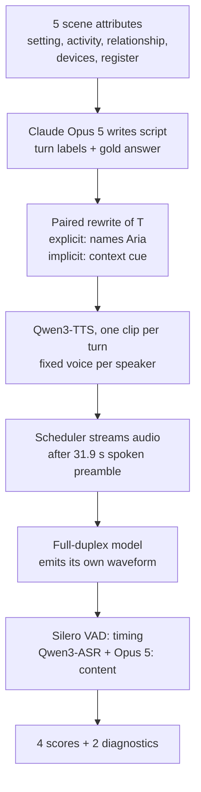

## Part I: Why should I care? { .rd-part }

## ⚡ The hook { #hook }

Four classmates are arguing about where to eat. Someone lists the taco place at nine dollars a head, someone else pitches karaoke at fifteen, a third mentions Luigi's at eleven. Then: *"Aria, out of those three, which one's cheapest per person?"* (App. A2.1, Table 4).

A good voice assistant says "the taco place" and then **shuts up**. It stays quiet when one friend asks Siri about the bus, when another mutters about being broke, and when someone says "see, this is why we keep Aria in here". Later someone asks Aria whether the taco place takes cards. Before Aria has finished, they say "never mind, I paid there Tuesday", and a good assistant **stops talking**.

Now the numbers. Across 2,000 conversations like this one, Freeze-Omni has speech running after **99.55%** of the requests addressed to it. Judged on response rate alone, it's the best model tested. It also talks in all but **5 of 20,360** stretches where it should have stayed silent (§4.1, Table 3).

"Did it respond?" turns out to be the wrong question. By the end of this page you'll know the four questions Duplex-MPE asks instead, how the benchmark is built from synthetic speech, what it reveals about five open full-duplex models, and where it's on firm ground versus leaning on assumptions.

## ⚡ The paper in one picture { #one-picture }

**One sentence.** To judge an assistant sitting in a group conversation, score starting, answering, staying silent and stopping on separate denominators, because a single "did it respond?" number hides which of those it is failing.

**One paragraph.** An LLM writes 2,000 multi-party conversation scripts. Each has exactly one request to the assistant "Aria" (label **T**), plenty of turns where Aria should stay quiet (**N1–N3**), and sometimes a question to Aria that a human then resolves (**N4**). Every script comes in two versions: one where T names Aria, one where only context tells you it's for Aria. TTS voices the humans, and the audio streams into a full-duplex speech model with no transcript and no turn boundaries. The model's own output waveform is then scored with VAD, ASR and an LLM judge on four separate capabilities, and deliberately never averaged (§3, Table 2).

<figure class="rd-fig" markdown>
--8<-- "papers/2609.31948-duplex-mpe/assets/one-picture.svg"
<figcaption><strong>What to notice:</strong> the turn strip is the actual 13-turn scenario from the paper's Table 4. Only 2 of 13 turns want speech from Aria, and one of those also wants it to stop. Everything else is a test of silence.</figcaption>
</figure>

## Primer: what you need first { #primer }

??? deep "Open the primer (skip if you ticked every prerequisite)"

    ### Full-duplex speech models { #primer-duplex }

    A classic voice assistant is **half-duplex**, like a walkie-talkie. VAD decides you've stopped talking, ASR transcribes, an LLM replies, TTS speaks, and while it speaks, it isn't listening (or it treats any sound as a barge-in).

    A **full-duplex** model listens and speaks at the same time. Moshi, for example, models the user's audio stream and its own audio stream in parallel, producing an output audio frame (often silence) at every time step while it keeps consuming input frames (§1, App. A1.1). Nothing external decides when it should talk. The model chooses, frame by frame, whether its output is speech or silence.

    That's what makes this benchmark possible and hard. There's no "turn" to hand the model; you just play audio and watch what comes out.

    !!! bridge "Speech bridge"
        Think of a streaming transducer (RNN-T) emitting a symbol or *blank* at every frame. A full-duplex model does the same with its own voice: every frame, it decides between "blank" (silence) and speech. **Where it breaks:** an RNN-T's blanks never reach the user. A full-duplex model's decision to emit non-blank frames *is* the observable behaviour, so a wrong decision is heard by everyone in the room.

    ### Turn-taking vocabulary: floor, backchannel, addressee { #primer-turntaking }

    - **The floor**: the right to speak. Taking it means starting a turn; **yielding** it means stopping so someone else can talk.
    - **Backchannel**: short noises like "mm-hm", "right", "understood" that show you're listening *without* taking the floor. Duplex-MPE allows these during silence windows (§3.5).
    - **Addressee**: whom an utterance is for. In a room with four people and two devices, "which one's cheapest?" could be for anyone. **Explicit** addressing names the target ("Aria, …"); **implicit** addressing leaves it to context ("you've been logging all three numbers, so run it", Table 5).
    - **Device-directed speech detection**: the product version of addressee recognition. Is this utterance meant for the device at all? (§2)

    ### LLM-as-judge scoring { #primer-judge }

    Some outputs have no exact-match answer. "It's the taco place, nine bucks" and "tacos, nine a head" are both correct. So the benchmark transcribes the model's speech with ASR (Qwen3-ASR-1.7B) and asks a strong LLM (Claude Opus 5) to judge it against the gold answer, or to classify stray speech as a harmless acknowledgement or a real intrusion (§3.5, App. A3.3).

    The standard worry is that the judge is wrong or biased. The standard fix is to have humans label a sample and report agreement, which this paper does: 99/100 and 98/100 (Table 11).

    ### Paired tests: McNemar and the bootstrap { #primer-stats }

    When the *same items* are tested twice (explicit vs implicit version of the same scenario; model A vs model B on the same windows), you should compare them item by item, not as two independent averages.

    **McNemar's test** ignores items where both conditions agree and looks only at the **discordant** ones. If the model responded only in the explicit version on \(b\) pairs and only in the implicit version on \(c\) pairs, then with no real difference each discordant pair is a fair coin flip, so \(b \sim \mathrm{Binomial}(b+c, \tfrac12)\). The exact test asks how surprising the observed split is.

    *Tiny example:* MiniCPM-o has \(b = 90\), \(c = 78\) (Table 16). Out of 168 coin flips, 90 heads is unremarkable: \(p = 0.396\). We re-computed this with `scipy.stats.binomtest(90, 168)` and got the same value as the paper.

    **The bootstrap** estimates uncertainty by resampling: draw 2,000 scenarios *with replacement* from the 2,000 you have, recompute the score difference, repeat 10,000 times, and take the middle 95% of results as a confidence interval (§4.5, App. A7.1).

    !!! bridge "Speech bridge"
        This is exactly how you should compare two ASR systems: per-utterance, with a matched-pairs test (the classic MAPSSWE/sign test), rather than eyeballing two corpus-level WERs. **Where it breaks:** WER differences are continuous per utterance; here each item is a yes/no outcome, which is why McNemar's binomial form fits.

## The problem { #problem }

Existing full-duplex benchmarks ask good questions, but always about **one designated user**. Talking Turns and Full-Duplex-Bench test when the model takes, holds or yields the floor in a two-party exchange. Full-Duplex-Bench v1.5 and HumDial add side conversations and third-party speech, but as *interference*: the right behaviour is to ignore it and keep serving the main user (§2, Table 1).

<figure class="rd-fig" markdown>
--8<-- "papers/2609.31948-duplex-mpe/assets/problem.svg"
<figcaption><strong>What to notice:</strong> on the right, speech not addressed to Aria isn't noise. A's price list is the <em>evidence</em> for D's later question, and C's "never mind" changes what Aria should do. You can't solve this by filtering out everyone but one user.</figcaption>
</figure>

Here is the concrete failure the older framing can't catch. In the taco scene, turns 1–3 are addressed to the other humans, so Aria must stay quiet. They also contain the prices it needs for turn 4 (App. A2.1). A model trained to *reject* side talk would throw away the answer. A model that *responds to everything* would answer turns 1–3. Neither failure shows up if you only score "did it answer the request".

!!! paper "The paper says (§1)"
    Existing benchmarks "largely centre on a designated user" rather than an assistant participating in a shared conversation, where any speaker can request help, supply evidence, or resolve a request.

!!! take "Our take"
    The sharpest part of the framing is the last clause: **a human can resolve Aria's request**. That's the one situation where the right action flips mid-response (answer, then stop), and it's absent from every single-user benchmark, because there the only person who can "resolve" the request is the one who asked.

⏸️ Before reading on:

!!! predict "Pause and predict"
    You're designing the metric. The obvious choice is "response rate on T requests". Name one way a model can score near 100% on that metric while being useless in the room.

    ??? answer "Reveal"
        Talk all the time. If speech is already running when the request ends, "did it respond?" says yes. Freeze-Omni does exactly this: 1,486 of its 2,000 explicit T requests find it *already speaking* (Table 9). The tempting answer, "answer every request but get them wrong", is a second, separate way (FLM-Audio: 2 correct out of 1,901, §4.1). You need a separate metric for each.

So a single response rate is too easy to game. What should you measure instead?
{ .rd-next }

## Part II: What and how { .rd-part }

## ⚡ The big idea { #big-idea }

**Presence isn't participation.** Having speech come out after a request is not evidence that the model decided to answer, answered correctly, knew when to stay out, or knew when to stop. Each of those is its own capability with its own denominator, and averaging them would let success on one hide failure on another (§3.5).

The mnemonic for the four: **Start, Say, Shush, Stop.**

| | Capability | Counted over |
|---|---|---|
| **Start** | fresh-onset response rate | all 2,000 T requests |
| **Say** | conditional answer accuracy | T requests where speech was present |
| **Shush** | silence preservation | every N1, N2, N3 window (20,360 per condition) |
| **Stop** | answering-window yield | N4 events where the model started answering in the gap and was still talking when the human resolved it |

!!! bridge "Speech bridge"
    You already know this move from WER. A single WER number blends substitutions, deletions and insertions; a system that deletes everything and one that hallucinates everything can both hit 100% WER. Splitting the errors tells you *which* failure you have. **Where it breaks:** WER's parts share one denominator (reference words) and add up. Duplex-MPE's four scores deliberately use *different* denominators and never add up.

!!! predict "Pause and predict"
    Freeze-Omni has near-perfect response presence (0.9955). Guess its **Start** score (fresh-onset rate): high, middling, or low?

    ??? answer "Reveal"
        Low: **0.2525**, the worst of the five (Table 3). Most of its "responses" were speech already running when the request ended, so they don't count as a fresh decision to answer. Many people guess "high" because presence and fresh onset sound like the same thing.

## How it works { #how-it-works }

For a benchmark, "how it works" means two things: how the data is built, and what exactly each score counts.

### Start from the simplest version

**Naive version: record a few groups talking with an assistant, and count how often it answers when asked.** This breaks four ways:

1. **Labels are expensive.** Someone has to mark who every utterance was addressed to, and whether the assistant should speak. → *Fix: generate scripts with the labels built in.*
2. **"Answers when asked" rewards chatter.** → *Fix: separate Start from mere presence, and add Shush.*
3. **You can't tell if the model understood "Aria" or just the context.** → *Fix: pair every scenario with an explicit and an implicit version.*
4. **Real rooms differ in acoustics, speakers, microphones.** Differences between models could be about audio, not behaviour. → *Fix: synthesise every human turn with the same TTS voices and play identical audio to every model.*

Each fix is a piece of Duplex-MPE.

### The turn taxonomy (§3.1)

Every turn gets exactly one label:

| Label | What it is | Aria must | Example from Table 4 |
|---|---|---|---|
| **T** | a direct, unresolved request to Aria (exactly one per scenario) | answer | "Aria, out of those three, which one's cheapest per person?" |
| **N1** | Aria is mentioned but not asked anything | stay silent | "this is exactly why we keep Aria in here" |
| **N2** | addressed to someone or something else (a human, *another assistant*) | stay silent | "Hey Siri, how long is the bus…" |
| **N3** | no addressee: self-talk, thinking aloud | stay silent | "I've got eleven until Friday, so that's, uh…" |
| **N4_Q → N4_R** | a question to Aria, then a human answers it or says Aria needn't | answer in the 3 s gap, then stop | "does the taco place take card?" → "never mind, I paid card there Tuesday" |

T is never the first turn and is always followed by more conversation, so "the scene ended" can't be used as a cue to speak (§3.2).

### How the data is built (§3.2, Fig. 2)

<figure class="rd-fig" markdown>



<figcaption><strong>What to notice:</strong> LLMs appear at both ends. Opus 5 writes the scripts and gold answers <em>and</em> judges the model's answers. Hold that thought for Part IV.</figcaption>
</figure>

The key numbers:

- **2,000 scenarios**: 1,500 with three humans and 500 with four, plus Aria (App. A2.2).
- T is placed early-middle, middle or late-middle (667 / 667 / 666 scenarios); 968 scenarios have an N4 event after T (App. A2.2).
- Each human turn is synthesised separately by Qwen3-TTS with a fixed speaker-to-voice map (A → "ryan", B → "aiden", C → "eric", D → "dylan"), stored at 24 kHz. Per-turn synthesis gives exact turn boundaries for free (App. A2.3).
- **61.10 h** of distinct speech clips; the 4,000 evaluated conversations total **110.93 h**, about **99.8 s** each on average (§3.2, App. A2.4).

### The explicit/implicit pairing (§3.3)

For every scenario, the T request is rewritten so that one version names Aria and the other only implies it (Table 5):

- **Explicit:** "…; *Aria*, out of those three, which one's the cheapest per person?"
- **Implicit:** "…; *you've been logging all three numbers, so run it*: which one's cheapest per person?"

Note the implicit version doesn't just delete the name. Deleting it would leave a request that could plausibly go to a human in the room (§3.3). When T alone can't carry a cue, the preceding turn is also edited (42 of 2,000 pairs). After later N4 edits, 1,661 pairs differ *only* at T; 339 have other text differences too, 16 of them with different turn counts (App. A2.4). The gold answer is identical in every pair.

!!! paper "The paper says (§3.3)"
    Because N4 edits and separate synthesis introduce differences beyond the name, response presence is compared between complete paired scenarios "without attributing the difference solely to the presence of the name".

### The runtime protocol (§3.4, App. A3.1)

Each model starts from a fresh state and hears:

\[
\underbrace{\text{spoken duty preamble}}_{\text{31.9 s: who Aria is, when to speak}} \;+\; \underbrace{\text{continuous multi-party scenario audio}}_{\text{no transcript, labels, or boundaries}}
\]

The preamble is spoken audio, not a text system prompt. It tells the model it is Aria, should respond only when spoken to directly with something it can answer, and should stay silent otherwise, including when someone else has already answered (App. A3.1).

The **scheduler** plays human turns in order with 0.5 s of silence between them, with two special rules:

- **After T:** the model gets 5 s to begin speaking. If it's speaking, the scheduler waits for 2 s of confirmed silence (capped at 60 s) before playing the next turn. The conversation politely waits for Aria's answer.
- **After N4_Q:** the scheduler always waits exactly 3 s, then plays N4_R *whether or not the model has finished*. This is the trap: a model mid-answer hears a human resolve the question and must stop.

All timing is measured on the model's **decoded waveform** with causal **Silero VAD**: at least 120 ms counts as speech, pauses under 800 ms are merged (§3.4). Token timestamps aren't used, because vocoding delays what's actually audible.

!!! bridge "Speech bridge"
    This is endpoint detection, the same VAD settings you'd tune for a streaming ASR front end (minimum speech duration, hangover/merge time), but pointed at the *model's output* instead of the user's input. **Where it breaks:** in ASR, a sloppy endpointer costs latency or clipped words. Here the 800 ms merge decides whether a model that pauses and resumes counts as "stopped". The paper's Moshi results depend on it (§4.3).

### ⚡ The four scores in three minutes { #four-scores }

The paper defines each score in words (Table 2). The notation below is ours, to make each counting rule explicit. For each T request \(t\), let \(e_t\) be the time T ends, \(a(\tau)\) = "model speech is active at time \(\tau\)", and \(o\) a speech onset.

**Start: fresh-onset response rate.**

\[
\mathrm{FO} = \frac{1}{|\mathcal{T}|}\sum_{t\in\mathcal{T}} \mathbb{1}\big[\,\neg a(e_t)\;\wedge\;\exists\,o\in(e_t,\,e_t+5\,\mathrm{s}]\,\big]
\]

| Symbol | Meaning |
|---|---|
| \(\mathcal{T}\) | the 2,000 T requests in one condition |
| \(e_t\) | end of request \(t\) |
| \(a(e_t)\) | the model was already speaking when T ended |
| \(o\) | the start of a new VAD speech segment |

*In words:* the model was silent when the request finished, and started a new utterance within 5 s. *Tiny example:* MiniCPM-o, explicit: 1,900 fresh onsets out of 2,000 → **0.950** (Table 9).

**Diagnostic: response presence** \(\mathrm{RP}\) drops the "was silent" condition: any speech in the window counts, continuation included. MiniCPM-o: (1,900 fresh + 9 already speaking) / 2,000 = **0.9545**. The gap \(\mathrm{RP}-\mathrm{FO}\) is exactly the share of requests where the model was already talking (App. A3.2).

**Say: conditional answer accuracy.**

\[
\mathrm{ACC} = \frac{\#\{\text{response-present } t \text{ judged correct}\}}{\#\{\text{response-present } t\}}
\]

*In words:* of the requests where there's speech to judge, how many does the judge (Opus 5 reading the Qwen3-ASR transcript) call correct? Silent requests are excluded, since there's nothing to grade, but they already cost the model on FO. Unparseable verdicts count as wrong. *Tiny example:* MiniCPM-o, explicit: 0.4730 × 1,909 present ≈ 903 correct (Table 3, Table 9).

**Shush: silence preservation.**

\[
\mathrm{SP} = \frac{\#\{w\in\mathcal{W}_{N1\text{–}N3} : \text{no speech, or only a brief acknowledgement}\}}{|\mathcal{W}_{N1\text{–}N3}|}
\]

*In words:* for every silence-requiring turn, a window passes if VAD hears nothing. If it hears something, the speech is transcribed and Opus 5 decides whether it's a harmless backchannel ("Understood.") or a substantive intrusion. Content matters, not length: even a short "Nine dollars" is an intrusion (App. A3.3). An empty transcript after detected speech counts as a fail. *Tiny example:* Freeze-Omni passes 5 of 20,360 windows → **0.0002** (§4.1).

**Stop: answering-window yield.** This one has the trickiest denominator (§3.5, App. A4.1). An N4 event is **eligible** only if the model (1) was silent during the question, (2) started speaking within 3 s after it, and (3) was still speaking when N4_R began at \(t_R\). An eligible event **passes** if the model is silent at \(t_R + 2\) s and stays silent until the resolution clip ends plus 0.5 s (\(t_E\)).

\[
\mathrm{YIELD} = \frac{\#\{\text{eligible events silent over } [t_R+2\,\mathrm{s},\,\max(t_R+2\,\mathrm{s},\,t_E)]\}}{\#\{\text{eligible events}\}}
\]

*Tiny example:* MiniCPM-o, explicit: 1,633 eligible, 974 yielded → **0.596** (Table 15). The rate is only reported when at least 30 events are eligible (§4.3).

<figure class="rd-fig" markdown>
--8<-- "papers/2609.31948-duplex-mpe/assets/timing.svg"
<figcaption><strong>What to notice:</strong> in case B the model "responded" to T only in the sense that it never stopped talking. In the N4 row, the amber band is what's scored: finishing before the deadline passes, and so does stopping after the human clip has ended, as long as the model is silent at <em>R + 2 s</em>. Redrawn from the rules in §3.5 and App. A4.1 (compare Fig. 3 in the paper).</figcaption>
</figure>

**Second diagnostic: window response** is any speech from the start of N4_Q through the 3 s gap. It tells you how much of the N4 set a model *touched*, which you need in order to read the yield rate.

Now play with the rules:

<div class="rd-widget" id="mpe-timeline" role="group" aria-label="Timeline scorer: toggle assistant behaviours and see how each Duplex-MPE metric scores them"><noscript>This widget needs JavaScript.</noscript></div>
<script src="assets/widget-timeline.js"></script>
<p class="rd-widget-caption"><strong>Try this:</strong> start from <em>Ideal</em>, then switch on <em>Talk over the N4 question</em>. The yield verdict changes from PASS to EXCLUDED, not FAIL. Then try <em>Resumer</em>: silent at the deadline, but it still fails. (The scenario timings are ours; the rules are the paper's.)</p>

!!! predict "Pause and predict"
    A model answers the N4 question, finishes its answer 0.5 s *before* N4_R begins, and stays quiet. Pass, fail, or excluded?

    ??? answer "Reveal"
        **Excluded.** It wasn't speaking when N4_R began, so there was nothing to stop, and the event doesn't enter the yield denominator (§3.5). The tempting answer is "pass", because it behaved well. But the metric only measures *stopping*, and this event can't show whether the model can stop. This design choice has big consequences in Part III.

### Pseudocode of one evaluation episode

```text
state = model.fresh_state()
stream(model, preamble_audio)            # 31.9 s spoken duty instruction, then 0.5 s silence
for turn in scenario.turns:              # open-loop: humans never react to what Aria says
    stream(model, turn.audio)
    if turn.label == "T":
        wait up to 5 s for an onset; if speaking, wait for 2 s of silence (cap 60 s)
    elif turn.label == "N4_Q":
        stream(model, 3 s of silence)    # then N4_R plays no matter what
    else:
        stream(model, 0.5 s of silence)
out = model.output_waveform
segments = silero_vad(out, min_speech=120ms, merge_gap=800ms)
score FO, RP on T; ACC via ASR + judge; SP per N1–N3 window via VAD (+ ASR + judge if speech); YIELD on eligible N4
```

### The text reference: a manipulation check (§3.4, §4.2)

How do you know the implicit versions really are harder to recognise as addressed to Aria? Give the *transcripts* to a strong text LLM and see if it notices. Gemini 3.1 Pro gets the duty instruction, the current utterance and the preceding speaker-attributed dialogue, and chooses RESPOND or SILENT for each utterance (App. A5.2).

!!! paper "The paper says (§3.4)"
    The text reference is "neither an acoustic system nor an upper bound on speech-model performance". It establishes that the paired intervention changes a transcript-conditioned decision.

### Human validation (§3.5, App. A3.4)

Six student reviewers, two per item, resolving disagreements by discussion, checked 100 sampled conversations (1,282 TTS turns) and 200 model outputs:

| Check | n | Pass / agree |
|---|---|---|
| T addresses Aria (explicit / implicit) | 50 / 50 | 100% / 100% |
| T has a unique answer from the preceding dialogue | 100 | 100% |
| Gold answer correct and supported | 100 | 98% |
| N1–N3 need no substantive response | 992 | 99.70% |
| TTS intelligible and faithful | 1,282 | 100% |
| ASR preserves model output meaning | 200 | 100% |
| Humans agree with Opus 5 on answer correctness | 100 | 99% |
| Humans agree with Opus 5 on acknowledgement vs intrusion | 100 | 98% |

<p style="font-size:0.8em">Numbers from Table 11.</p>

We've built the benchmark and pinned down the counting rules. Before looking at real models, can we see the "presence isn't participation" effect with toy behaviours whose inner workings we fully know?
{ .rd-next }

## Build a toy version { #toy }

!!! take "Educational simplification"
    This toy keeps the scoring mechanism and drops everything else: no audio, no real model, no ASR and no LLM judge (so no backchannel exemption and no accuracy score), a fixed open-loop schedule (no waiting for the answer to finish), and four hand-scripted "policies" instead of speech models. It re-implements the paper's timing rules (VAD min 120 ms and 800 ms merge, 5 s T window, 3 s N4 gap, R + 2 s deadline, R end + 0.5 s observation, n ≥ 30 reporting) on 10 ms frame masks in PyTorch. It is not the paper's scoring code, which is not yet released.

Each synthetic scenario has nine turns (N2, N1, N2, **T**, N3, N2, **N4_Q**, **N4_R**, N2). Four policies:

- **selective**: answers T and N4, sometimes runs long past the deadline, and rarely intrudes;
- **shy**: often misses T and N4, but stops quickly when it does answer;
- **never-stop**: answers everything and keeps going for 12 s after N4, and often intrudes;
- **chatterbox**: talks through the whole conversation.

```python
--8<-- "papers/2609.31948-duplex-mpe/assets/toy.py"
```

Real output (Python 3.10, PyTorch 2.13 CPU, 1.9 s, 300 scenarios per policy):

```text
selective   presence 0.96  fresh 0.96  silence 0.81  window 0.95  yield 0.39 (n=256)
shy         presence 0.61  fresh 0.61  silence 0.77  window 0.64  yield 1.00 (n=131)
never-stop  presence 0.96  fresh 0.96  silence 0.22  window 0.99  yield 0.00 (n=116)
chatterbox  presence 1.00  fresh 0.00  silence 0.00  window 1.00  yield n/a (n=0)
```

**Read it like this.** The chatterbox wins on presence and window response, yet scores **0.00** on fresh onset and silence, and its yield can't even be computed: it's never silent during the question, so no event is eligible. That's Freeze-Omni's profile in miniature. "Never-stop" and "selective" have identical presence (0.96) but opposite Shush and Stop. And the best yield belongs to **shy** (1.00), which answered far fewer N4 questions. Keep that last row in mind when you see Voila's numbers.

!!! take "What the toy also shows"
    Our "selective" policy only scores 0.81 on silence, even though it intrudes in just 8% of N-turns. The rest is *spill-over*: answers to T or N4 that run into the next silence window. In the real benchmark, the scheduler waits for T answers to finish (up to 60 s), which removes most T spill-over, but not N4 spill-over, because N4_R plays on a fixed clock. Long N4 answers therefore cost a model on both **Stop** and **Shush**. The two metrics aren't fully independent.

## Part III: Does it actually work? { .rd-part }

## ⚡ The evidence { #evidence }

### What's measured, and how to read Table 3

Five open-weight full-duplex systems were selected for public code and weights, continuous audio input, and an interface that lets the model decide when to speak: **MiniCPM-o 4.5, Moshi** (moshiko checkpoint), **FLM-Audio, Voila** (autonomous-preview) and **Freeze-Omni** (App. A1.3). All four scores run from 0 to 1, higher is better. Table 3 carries the argument. Read it *column-pair by column-pair*: presence next to fresh onset, presence next to accuracy, presence next to silence.

| Model (explicit) | Start FO | Say ACC | Shush SP | Stop YIELD | presence | window |
|---|---|---|---|---|---|---|
| MiniCPM-o 4.5 | **0.950** | **0.473** | **0.924** | 0.596 | 0.955 | 0.951 |
| Moshi | 0.634 | 0.012 | 0.273 | 0.192 | 0.816 | 0.923 |
| FLM-Audio | 0.538 | 0.001 | 0.396 | 0.008 | 0.951 | 0.993 |
| Voila | 0.647 | 0.003 | 0.835 | **0.848** | 0.652 | 0.622 |
| Freeze-Omni | 0.253 | 0.004 | 0.0002 | n/a (n = 1) | 0.996 | 1.000 |

<p style="font-size:0.8em">Explicit condition, rounded from Table 3. Implicit numbers are within a few points of these; use the explorer below.</p>

<div class="rd-widget" id="mpe-results" role="group" aria-label="Results explorer: bar chart of each Duplex-MPE metric for five speech systems and the text reference"><noscript>This widget needs JavaScript.</noscript></div>
<script src="assets/widget-results.js"></script>
<p class="rd-widget-caption"><strong>Try this:</strong> click <em>Response presence</em>, then <em>Fresh-onset response</em>, and watch the rank labels. Freeze-Omni goes from #1 to #5. Then compare <em>Answering-window yield (as scored)</em> with our derived <em>Yield over all N4 events</em>. Numbers from Tables 3, 15 and 17.</p>

### Result 1: presence says almost nothing on its own (§4.1)

Three contrasts, each isolating one capability:

- **Presence vs Start.** Freeze-Omni: presence 0.9955, fresh onset 0.2525. FLM-Audio: 0.9505 vs 0.5380. MiniCPM-o: 0.9545 vs 0.9500.
- **Presence vs Say.** MiniCPM-o and FLM-Audio have near-identical presence (0.9545 vs 0.9505), but FLM-Audio answers **2 of 1,901** correctly (accuracy 0.0011) against MiniCPM-o's 0.4730.
- **Presence vs Shush.** Moshi has higher presence than Voila (0.8155 vs 0.6515) but far lower silence preservation (0.2734 vs 0.8351).

Across the ten model × condition entries, rankings by presence and by fresh onset have a Spearman correlation of **−0.43**. Under explicit addressing, *none* of the five models keeps its rank (§4.5).

<figure class="rd-fig" markdown>
--8<-- "papers/2609.31948-duplex-mpe/assets/partition.svg"
<figcaption><strong>What to notice:</strong> the amber segments. For Freeze-Omni and FLM-Audio, much of the "response" is speech that was already running when the request ended. Voila's long grey segment means it misses about a third of requests outright. Explicit condition; numbers from Table 9.</figcaption>
</figure>

!!! take "Our take"
    Only one of the five systems answers correctly more than 2% of the time. For the other four, the benchmark mostly measures *timing and restraint*, because there's almost no answer content to compare. That's still informative, but "MiniCPM-o leads on three scored capabilities" (§4.1) partly reflects that it's the only system here that's really an instruction-following assistant.

### Result 2: naming Aria changes the text model a lot, and the speech models not at all (§4.2)

| System | Responds to T: explicit | implicit | paired difference | exact McNemar \(p\) |
|---|---|---|---|---|
| Gemini 3.1 Pro (transcripts) | 0.947 | 0.304 | **+64.3 pp** | \(< 10^{-371}\) |
| MiniCPM-o 4.5 | 0.955 | 0.949 | +0.60 pp | 0.396 |
| Moshi | 0.816 | 0.822 | −0.65 pp | 0.614 |
| FLM-Audio | 0.951 | 0.954 | −0.35 pp | 0.654 |
| Voila | 0.652 | 0.669 | −1.75 pp | 0.237 |
| Freeze-Omni | 0.996 | 0.998 | −0.20 pp | 0.424 |

<p style="font-size:0.8em">From §4.2, Table 16, Table 17. Response here means response presence.</p>

Given text, Gemini treats the name as a strong addressing cue. The speech systems show no detectable difference.

!!! paper "The paper says (§4.2)"
    The null result could reflect either successful inference of the addressee from context, or failure to recognise the name as an addressing cue at all. The tests don't distinguish these, and "insufficient evidence of a difference does not establish that the conditions are equivalent" (App. A5.1).

!!! predict "Pause and predict"
    MiniCPM-o responds to 94.9% of *implicit* requests while Gemini, reading perfect transcripts, responds to only 30.4%. Before reading on: does that mean MiniCPM-o is better at inferring addressees than Gemini?

    ??? answer "Reveal"
        Not necessarily. Two clues say be careful. First, MiniCPM-o's responses barely move between conditions, which is what you'd see if it ignored addressing cues and responded to *question-shaped* turns. Second, it does usually stay quiet on requests aimed at others: it fails silence on 216 of 4,704 human- or device-directed requests, 4.6% (§4.2, Table 19). So it discriminates *something*. What it keys on (the name, context, question form, or something about T's content) isn't isolated by this design. Gemini's low implicit rate might also reflect conservatism rather than inability: it keeps 99.3% silence preservation in the implicit condition (Table 17).

### Result 3: the Stop score must be read with its denominator (§4.3)

Voila has the best yield (0.848 explicit), but only 620 of 1,911 N4 events are eligible. MiniCPM-o has 1,633 eligible. Freeze-Omni is *already speaking* when the question starts in 1,784 events, and has just 1 eligible event (Table 14).

Failures come in two kinds (Table 15):

- **Still voicing** at the deadline: FLM-Audio in 968 of 977 scored events.
- **Resumed**: silent at the deadline, then talking again before observation ends. That's Moshi in 97 of its 177 failures. This is why the rule demands *continued* silence, not just a pause.

!!! take "Our derived view (not a paper metric)"
    Divide each model's *yielded* events by *all* 1,911 N4 events and the picture changes: MiniCPM-o 974/1,911 ≈ 0.51, Voila 526/1,911 ≈ 0.28, Moshi ≈ 0.02 (Table 15 counts). The paper warns about this directly: Voila's high rate "describes stopping on its eligible events, not overall N4 performance" (§4.3). Our toy's "shy" policy shows the same effect.

### Result 4: later requests are harder for some models (§4.4, Table 13)

Requests are split by elapsed time before T into thirds (boundaries 40.2 s and 54.7 s, App. A3.6). From earliest to latest:

- Voila's presence falls from 71.64% to 59.55% (explicit) and from 76.21% to 55.82% (implicit).
- FLM-Audio's fresh onset falls from 67.61% to 47.67% (explicit), while its presence stays above 94%. It isn't going quiet; it's increasingly *already talking*.
- MiniCPM-o's accuracy falls from 50.69% to 46.82% (explicit). The middle group is lowest (44.27%), so the trend is not monotonic.

### Robustness checks (§4.5, App. A3.5, A7)

- **Duration thresholds instead of the judge.** Scoring silence purely by detected speech duration (> 0, 100, 200, 300, 500 ms, with no semantic exemption) leaves the model ordering unchanged in both conditions (Table 12).
- **Bootstrap.** 10,000 scenario-level resamples put MiniCPM-o ahead of Voila, the closest pair, on silence by **8.25 to 9.58 pp** (95% CI). All silence-preservation pairwise orderings hold (App. A7.1).
- **Paired accuracy tests.** With Bonferroni correction over 20 tests per condition, MiniCPM-o beats every other model and Moshi beats FLM-Audio; most other accuracy pairs are not significantly different (Table 21).
- **Judge stability.** Two runs of the Gemini reference agree on 97.2% of 48,542 decisions, but its explicit answer accuracy moves from 90.39% to 97.02% between runs (App. A5.2).

### What isn't shown

We searched the full text and LaTeX source before listing these:

- **No real recordings.** Every human turn is TTS from four fixed voices at 24 kHz; no room acoustics, noise, overlap between humans, or real disfluent speech (§3.2, Ethics statement).
- **No decoding settings or repeated runs** for the speech systems. We found no temperatures or sampling settings, and each system appears to be run once per condition.
- **The "non-scored probe" of instruction sensitivity** for non-full-duplex models under a segmented interface is mentioned (§3.4), but we found no results for it in v1.
- **No cascaded or proprietary duplex baselines** (e.g., a VAD + ASR + LLM + TTS pipeline with an addressee classifier). The paper explains why segmented systems aren't scored (§3.4), but that also means we can't see how far a simple pipeline would get.
- **Data and code aren't public yet.** The paper promises manifests, audio, scheduler settings and scoring code (Reproducibility statement); the project page currently has audio demos only (found by us).

The measurements are careful. But are they measuring the right thing, and would another design have been better?
{ .rd-next }

## Part IV: Think like a reviewer { .rd-part }

## Why this way and not another { #why-not }

<div class="rd-wide" markdown>

| Choice | Obvious alternatives | Why this one | What would likely happen otherwise | Evidence |
|---|---|---|---|---|
| Four scores, never averaged (§3.5) | One composite "interaction score" | Success on one denominator can't compensate for failure on another | A composite would put Freeze-Omni's 0.9955 presence and 0.0002 silence into one middling number that describes neither | 📄 §3.5, §4.1 |
| Fresh onset as the scored response metric; presence only as a diagnostic | Score response presence | Presence credits speech that never stopped | Rankings flip: Spearman −0.43 between the two; Freeze-Omni first under presence, last under FO | 📄 §4.5 |
| Semantic backchannel exemption for silence | Pure duration threshold | "Understood." is fine, "Nine dollars" isn't, whatever the length | The ordering survives either way, but absolute scores move: Moshi 0.085 at 0 ms vs 0.273 with the judge | 📄 Table 12 |
| Synthetic scripts + TTS | Record real groups | Labels, gold answers and exact boundaries come free; identical audio for every model; scales to fresh draws | Real data would test acoustics and naturalness but need costly addressee annotation | 📄 §1, §5; 🧠 trade-off |
| Spoken duty preamble, same for all | Text system prompt; no instruction | Every system gets the same audio-only interface, with no harness-specific help | Models that can't follow spoken instructions are penalised for that too. See Reviewer's corner | 📄 §3.4; 🧠 consequence |
| Only full-duplex systems scored | Wrap half-duplex LLMs with a segmenter | A segmenter would decide when to "invoke" the model, making fresh onset partly a harness property; yield would be undefined | We'd be benchmarking the segmenter | 📄 §3.4 |
| Yield only on eligible N4 events, reported at n ≥ 30 | Score all N4 events | Stopping is only testable if the model is mid-answer at N4_R | Ineligible events would count silent models as "good stoppers" | 📄 §3.5, §4.3 |
| Open-loop humans (scripted, non-reactive) | Simulated humans that react to Aria | Reproducible; same stimulus for every model | Real conversations would adapt (people talk over, repeat, or wait), which changes what's correct | 🧠 reasoned; the paper doesn't discuss it |

</div>

**The decision that matters most** is the refusal to aggregate. Everything in Part III follows from it: the paper's main finding is literally "these numbers disagree with each other". A leaderboard-friendly single score would have made the benchmark more popular and much less informative.

## What's genuinely new { #novelty }

<figure class="rd-fig" markdown>
--8<-- "papers/2609.31948-duplex-mpe/assets/lineage.svg"
<figcaption><strong>What to notice:</strong> two lines of work run separately until the last node. Addressee recognition (top) always labelled a <em>given</em> utterance; duplex benchmarks (middle) always had <em>one</em> user. Duplex-MPE is where they meet. Lineage from §2 and App. A1.</figcaption>
</figure>

**Borrowed:**

- Turn-taking notions (floor, yielding, backchannel) from conversation analysis and full-duplex benchmarks such as Talking Turns and Full-Duplex-Bench (§2, App. A1.1).
- Addressee recognition as a task, from meeting corpora and multi-party chat work (Jovanovic & op den Akker 2004; Ouchi & Tsuboi 2016; Gu et al. 2021) (§2).
- Silence as a valid output, from text speak-or-stay-silent datasets (Bhagtani et al. 2026 and others) (§2).
- LLM-generated scripts, TTS audio and LLM-judge scoring, which are all standard tooling by 2026.

**New:**

- **No fixed user.** Any speaker can ask, supply evidence, or resolve. This is the one ✓ no other benchmark in Table 1 has.
- **Addressee inference as a latent decision** observed only through the model's own waveform, not as a classification output (§2).
- **The N4 resolve-then-stop event**, which tests whether the model notices that *someone else* made its answer unnecessary.
- **Explicit/implicit pairing** with a fixed gold answer, plus a text-LLM manipulation check.
- **Denominator discipline**: the fresh vs continuation split, the eligibility rules for yield, and the refusal to average.

🧠 Why not earlier? Open full-duplex models that can hold a conversation only arrived from late 2024 (Moshi), and TTS good enough to voice 26,000 turns per condition cheaply, and an LLM good enough to write *labelled* multi-party scripts, are both recent. The benchmark needs all three.

## Reviewer's corner { #reviewer }

**1. The spoken preamble tests instruction-following too.** Every system must learn from a 31.9 s spoken instruction that it is "Aria" and should stay quiet unless addressed (App. A3.1). Moshi-style models were not built to take spoken system prompts; MiniCPM-o is an instruction-tuned omni model. Some of the gap between them may be "can it follow a spoken role instruction?" rather than "can it infer addressees?". The segmented instruction-sensitivity probe that might separate these (§3.4) isn't reported in v1.

**2. One LLM family writes the answers and grades them.** Claude Opus 5 generates scripts and gold answers (§3.2) and judges correctness and intrusions (§3.5). Human agreement is high (99/100 and 98/100, Table 11), but the 100-item samples are stratified five correct and five incorrect per model and condition (App. A3.4), which measures agreement on a balanced set rather than on the true distribution. The Gemini reference is judged by *another Gemini call* (App. A5.2), so its accuracy isn't graded by the same judge as the speech systems'.

**3. Construct validity of "implicit".** Humans said 100% of the 50 sampled implicit T turns address Aria (Table 11), yet Gemini, with perfect transcripts, responds to only 30.4% of them (Table 17). Either Gemini is very conservative (its 99.3% implicit silence rate suggests so) or many implicit cues are weaker than the reviewers judged. The paper reports both numbers; it doesn't reconcile them.

**4. Possible shortcut cues.** T is always a factual, answerable question whose answer is in the preceding dialogue (Table 11 check), while many N-turns are social talk. A model that answers "questions with checkable answers" and ignores the rest could score well on Start and Shush without modelling addressees at all. The per-type breakdown in Table 19 (requests to humans, requests to devices) partly probes this: MiniCPM-o fails 3.6% of human-directed and 5.4% of device-directed requests (explicit). That's encouraging, but a targeted control (answerable questions to a *human*, with the answer in context) would settle it.

**5. Synthetic, clean, open-loop audio.** Four fixed TTS voices, 0.5 s gaps, no overlapping humans, no noise, no reverberation, and humans who never react to Aria (§3.2, §3.4). The paper states that its synthetic English scenes don't represent real acoustics or social norms (Ethics statement). The scores are about *these* scenes. How rankings transfer to a real living room is untested.

**6. Coupled metrics.** Because N4_R plays on a fixed clock, a model that gives long N4 answers loses on Stop *and* spills into the next silence window (our toy shows the mechanism). The metrics are separate, but not independent.

**7. Reproducibility today.** A single run per system, no reported decoding settings, and no public data or code yet (promised in the Reproducibility statement). The automated pipeline is a strength for fresh draws, but only once it's released.

!!! take "Steelman"
    **Criticism 1 (the preamble confounds instruction-following) → likely response:** a deployed assistant *must* take its role from somewhere, and a spoken instruction is the only interface all five models share without a custom harness. Adding per-model text prompts would make scores depend on how much prompt engineering each model got. **Where that leaves us:** fair as a measure of "what these systems do out of the box". Read low scores as "not usable this way", not "can't infer addressees".

    **Criticism 5 (synthetic audio) → likely response:** clean, identical audio is the *point* for a first benchmark. It removes acoustic confounds so behavioural differences are attributable to the decision policy, and the generator can produce fresh draws when a set gets contaminated (§5). **Where that leaves us:** a valid lower bound on difficulty. A real-recording companion set would be the natural next paper.

## Scope and boundaries { #scope }

**Where it works:** English, 3–4 speaker synthetic conversations of about 100 s, one T per scene, open-weight full-duplex speech models, and a spoken role instruction (§3, App. A2). Silence-preservation orderings are statistically solid (App. A7.1); accuracy rankings beyond "MiniCPM-o is best" mostly aren't.

**Where it probably breaks:**

- *Real meetings with overlap and crosstalk*: turns here never overlap, and real ones do constantly. VAD on the model output would be fine, but the model's input becomes much harder. 🧠
- *Speaker identity cues*: four fixed voices per scene. With real, varied voices, "who is speaking" becomes harder, and it matters for N4 (asker vs resolver). 🧠
- *Wake-word products*: an assistant gated by a keyword detector would trivially separate explicit from implicit, which is a different system design from the one tested here. 🧠
- *Long sessions*: T comes within about 14–264 s of the start (App. A3.6), and accuracy already drifts later. Hour-long meetings are untested.

**What it assumes about resources:** running five full-duplex models over 4,000 conversations of about 100 s plus waits, then ASR and LLM judging for every window with detected speech. The paper doesn't report GPU hours or API cost. 🧠 Order of magnitude: the audio alone is about 111 h per model across both conditions, and each model must run in real-time streaming mode.

## Part V: Beyond the paper { .rd-part }

## Applications { #applications }

- **Meeting assistants and in-car voice agents** (🧠): the exact setting of §1. Duplex-MPE's four numbers are a ready-made acceptance test before letting an assistant listen to a room.
- **Smart speakers in shared homes** (🧠): the N2 "Hey Siri" turns model a real product problem, several assistants in one room, each needing to know which one was addressed.
- **Evaluating your own endpointing/turn-taking model** (🧠): the fresh-onset vs continuation split and the "resumed" failure category apply to any duplex system, even single-user ones.
- **Unexpected: classroom or tutoring agents** (🧠): an AI tutor in a group should often *not* answer, because letting a student answer a peer's question is the pedagogical goal. N4 is literally "a human resolved it, so back off".

## What to carry forward { #carry-forward }

**For the field**

- Report behavioural metrics on **separate denominators** and show the denominator counts next to every rate.
- When a rate is conditional on eligibility, also report **how many events were eligible**, or readers will crown the wrong model (Voila's yield).
- A **paired intervention plus a text-LLM manipulation check** is a cheap way to verify that a benchmark manipulation actually changes the task.

**For your own work (speech systems)**

- If you build a duplex or streaming model, log **fresh onset vs continuation** separately. It costs one boolean per event and exposes "never stopped talking" immediately.
- Tune the VAD **merge gap** on your model's *output* deliberately. With an 800 ms merge, a pause-then-resume is "still talking", and Moshi's 97 resumed failures show that pattern is real.
- The Qwen3-TTS per-turn recipe (fixed voices, exact boundaries) is a fast way to build your own labelled multi-speaker test sets for diarization or target-speaker ASR.

## What's next { #whats-next }

**Follow-ups:** found by us: none yet. The paper was posted on 2026-09-25, and OpenAlex and Semantic Scholar list no citing papers as of 2026-09-30.

**Open problems the paper points to:**

- 📄 Distinguishing context-based addressee inference from ignoring the name altogether (§4.2).
- 📄 Larger or fresh evaluation draws from the automated pipeline (§5).
- 📄 Instruction sensitivity under a segmented interface (§3.4, mentioned as a non-scored probe).
- 🧠 A real-recording or human-in-the-loop companion set with overlapping speech.
- 🧠 Training signals from the benchmark: the labelled scripts are natural supervision for a "should I speak now?" head on a duplex model.
- 🧠 Multimodal addressing: gaze and head orientation are how humans resolve implicit addressing in real rooms.

## Brainstorm lab { #brainstorm }

**1. What if humans reacted to Aria?** Make N4_R depend on whether Aria has already answered correctly.

??? take "Suggested directions (think first)"
    - Branch the script: if Aria answered correctly before N4_R, the resolver says "right, thanks" instead of answering. Measure whether yield rankings change.
    - Simulate a human who repeats the question louder if Aria stays silent on T. That turns Start misses into recoverable events, and you can measure recovery rate.
    - Interesting result: a model that's currently penalised for talking long might look better when humans adapt, or worse if they talk over it.

**2. Laptop experiment: a "should I speak?" probe.** Take MiniCPM-o or Moshi hidden states at turn ends (a few thousand turns from the paper's released data once available, or your own Qwen3-TTS scenes) and train a linear probe for T vs N1–N3. About 1 GPU-hour.

??? take "Suggested directions (think first)"
    - If the probe is highly accurate but the model still speaks during N-turns, the knowledge is there and the *policy* is the problem, so fine-tuning the output head could fix it.
    - Compare probe accuracy on explicit vs implicit T. A big gap would reveal that the model encodes the name but not context.
    - Check layers: does addressee information appear early (acoustic) or late (semantic)?

**3. Transfer to speech AI: a target-speaker version.** In your ASR/TTS world, what's the analogue of N4?

??? take "Suggested directions (think first)"
    - Target-speaker ASR in meetings: the "request" is enrollment of a speaker, and "N4" is another person finishing that speaker's sentence. Should the transcript attribute it?
    - For TTS-driven agents, measure **barge-in latency** from N4_R onset to audio silence as a continuous metric instead of pass/fail at 2 s. Plot the distribution per model.

**4. Thought experiment: is 3 s the right gap?** The N4 answering window is fixed at 3 s (§3.1).

??? take "Suggested directions (think first)"
    - Human response latencies in conversation are typically a few hundred ms (🧠). A 3 s gap is generous, and a slow model can still become eligible.
    - Sweep the gap (1, 2, 3, 5 s) and plot eligibility and yield for each model. If Voila's eligibility jumps with longer gaps, its low eligibility is latency, not choice.

**5. Combine with a cascaded baseline.** Build VAD → Whisper → an addressee classifier → LLM → TTS and run it through the same audio.

??? take "Suggested directions (think first)"
    - The paper excludes segmented systems for good reasons (§3.4), but as an *unscored reference* it would show whether the end-to-end models are behind a simple pipeline on Shush.
    - Measure Start with the same 5 s window. A cascade may be too slow, which would be an honest point in favour of full-duplex models.
    - Use the Gemini transcript numbers as the "perfect ASR" upper corner of your cascade.

**6. What if you add a second assistant that actually answers?** Put a scripted "Siri" that responds aloud to N2 device requests.

??? take "Suggested directions (think first)"
    - Now machine speech appears in the input. Does Aria reply to Siri, or mistake Siri's voice for its own?
    - Measure silence preservation on windows containing assistant speech vs human speech. A model trained on user/assistant dual channels may treat any assistant-like voice as a cue to talk.

## Part VI: Lock it in { .rd-part }

## Self-quiz { #quiz }

**1. Name the four scored capabilities and the event set each is computed over.**

??? answer "Answer"
    Fresh-onset response rate (all 2,000 T requests), conditional answer accuracy (T requests with speech present), silence preservation (all N1–N3 windows), answering-window yield (eligible N4 events). A common slip is to list response presence as a score; it's a *diagnostic* (Table 2).

**2. What distinguishes N2 from N3?**

??? answer "Answer"
    N2 is addressed to someone or something else (another human, another device); N3 has no addressee at all (self-talk, thinking aloud). Both require silence (§3.1).

**3. Why does the paper refuse to average the four scores into one?**

??? answer "Answer"
    Because they're computed on different denominators and measure different failures; success on one can't compensate for failure on another (§3.5). An average would hide exactly the profiles the paper exposes, like Freeze-Omni's near-perfect presence and near-zero silence. "Averages lose information" is true but too generic; the specific reason is that a benchmark whose point is *distinguishing failure types* can't collapse them.

**4. Freeze-Omni's yield is reported as n/a. Why, and does that mean it's good at stopping?**

??? answer "Answer"
    It's already speaking when the N4 question starts in 1,784 of 1,911 events, and starts during the question in another 126, leaving one eligible event, and it fails that one (App. A4.1, Table 15). The rate needs at least 30 eligible events (§4.3). It says nothing good about stopping. It's a model that never goes quiet long enough to be tested.

**5. Gemini on transcripts shows a 64.3 pp explicit/implicit gap; the speech models show none. Give two different explanations for the speech models' null result.**

??? answer "Answer"
    (a) They infer the addressee from context equally well either way. (b) They ignore the name as a cue and respond based on something else (question form, timing), so removing it changes nothing. The paper names both and doesn't distinguish them (§4.2). A third subtlety: the McNemar tests show *no evidence of a difference*, which is not proof of equivalence (App. A5.1).

**6. Why is "Nine dollars" (under a second long) penalised in a silence window while "Understood." is allowed?**

??? answer "Answer"
    The exemption is semantic, not durational: a brief acknowledgement that adds no information and doesn't take the floor is allowed; anything that answers, explains or advises is an intrusion, whatever its length (App. A3.3). The tempting answer, "it's too long", is wrong, and it's why the paper also reports a duration-only sweep as a robustness check (Table 12).

**7. Application: you're shipping a full-duplex in-car assistant. Your dashboard shows "responds to 97% of driver requests". Which two numbers would you add first, and why?**

??? answer "Answer"
    Fresh-onset rate (is the 97% real decisions, or speech that never stopped?) and silence preservation on passenger-to-passenger talk (does it barge into conversations?). In a car, intrusions are the costlier failure. If requests often get resolved by a passenger, add yield with its eligible count.

**8. Application: you build a Qwen3-TTS test set for your own duplex model and get 0.98 silence preservation. Name one Duplex-MPE design detail you should copy before trusting that number.**

??? answer "Answer"
    Any of these: check that your model actually *spoke* elsewhere (a silent model gets 1.0 silence; report fresh onset alongside); score continuation vs fresh onset separately; include N1 turns that mention the assistant's name without a request, since name-triggered models fail those; use a semantic judge or at least a duration sweep, not a single VAD threshold.

**9. Spot the flaw.** *"Voila scores 0.848 on answering-window yield, far above MiniCPM-o's 0.596, so Voila is the best system at releasing the floor when a human resolves a request."*

??? answer "Answer"
    The yield rate is conditional on eligibility. Voila is eligible on 620 of 1,911 N4 events, MiniCPM-o on 1,633 (§4.3). Counting all N4 events, MiniCPM-o yields in 974 and Voila in 526. Voila often never starts an answer, or finishes before the resolution, so those events aren't tested. The paper says Voila's rate "describes stopping on its eligible events, not overall N4 performance" (§4.3). The claim confuses a conditional rate with an overall capability.

## ⚡ Remember this { #remember }

**Presence isn't participation.** Score starting, answering, staying silent and stopping separately, each on its own denominator, and never average them.

<figure class="rd-fig" markdown>
--8<-- "papers/2609.31948-duplex-mpe/assets/remember.svg"
<figcaption><strong>What to notice:</strong> even the best system answers correctly less than half the time. And STOP is a conditional rate: always ask how many events were eligible.</figcaption>
</figure>

1. **Start, Say, Shush, Stop.** Response presence alone ranked the models almost backwards (Spearman −0.43 against fresh onset).
2. **Other people's speech is evidence, not noise.** Aria must follow everyone and speak only when addressed, including stopping when a human resolves its question.
3. **Naming "Aria" moves a text LLM by 64 points and speech models by less than 2.** Speech models aren't (visibly) using the addressing cue the way a text model does.

**Sticky phrase:** *"Four S's, four denominators, zero averages."*

## Glossary { #glossary }

Addressee
:   The person or device an utterance is meant for.

Answering-window yield
:   Among eligible N4 events, the fraction where the model is silent 2 s after the human resolution starts and stays silent until it ends + 0.5 s.

Backchannel
:   A short acknowledgement ("mm-hm", "understood") that shows listening without taking the floor; allowed during silence windows.

Bootstrap
:   Estimating uncertainty by recomputing a statistic on many resamples (with replacement) of the data.

Conditional answer accuracy
:   Fraction of response-present T requests whose transcribed answer the judge marks correct.

Discordant pair
:   In a paired comparison, an item where the two conditions disagree; the only items McNemar's test uses.

Duty preamble
:   The 31.9 s spoken instruction played before each scenario, telling the model it is Aria and when to speak.

Explicit / implicit addressing
:   Whether the T request names Aria or leaves the addressee to context.

Floor
:   The right to speak in a conversation; taking, holding and yielding it are turn-taking actions.

Fresh-onset response rate
:   Fraction of T requests where the model was silent at request end and began new speech within 5 s.

Full-duplex model
:   A speech model that listens and speaks at the same time, deciding every frame whether to emit speech.

McNemar test
:   A paired test of whether discordant outcomes are equally likely in both directions; here in its exact binomial form.

N1 / N2 / N3
:   Silence-requiring turns: Aria mentioned but not asked; addressed to someone else; no addressee.

N4 (N4_Q, N4_R)
:   A question to Aria (Q) followed after 3 s by a human resolution (R); tests answering then stopping.

Response presence
:   Diagnostic: fraction of T requests with any model speech in the response window, including speech already underway.

Silence preservation
:   Fraction of N1–N3 windows with no model speech or only a brief acknowledgement.

T
:   The single unresolved request addressed to Aria in each scenario.

Window response
:   Diagnostic: fraction of N4 events with any model speech from question start to 3 s after.

## References and further reading { #references }

**The paper**

- Ma et al., *Duplex-MPE: Benchmarking Multi-Party Interaction in Full-Duplex Dialogue*, [arXiv:2609.31948](https://arxiv.org/abs/2609.31948) (v1 read). [Project page](https://step-out.github.io/Duplex-MPE-Page/) with audio demos. Data and scoring code promised but not yet released at the time of writing.

**Key prior work (why each matters here)**

- Défossez et al. 2024, [Moshi](https://arxiv.org/abs/2410.00037): the open full-duplex model family that made "just stream audio and watch" evaluation possible; one of the five systems tested.
- Lin et al. 2025, [Full-Duplex-Bench](https://arxiv.org/abs/2503.04721), and Lin et al. 2026, [Full-Duplex-Bench v1.5](https://arxiv.org/abs/2507.23159): the single-user duplex benchmarks Duplex-MPE contrasts with; v1.5 adds side talk as interference.
- Arora et al. 2025, *Talking Turns* (ICLR 2025): turn-taking evaluation of audio foundation models with one human.
- Ouchi & Tsuboi 2016, *Addressee and Response Selection for Multi-Party Conversation* (EMNLP 2016), and Gu et al. 2021, [MPC-BERT](https://arxiv.org/abs/2106.01541): addressee recognition as a supplied-utterance labelling task, the framing Duplex-MPE turns into a latent speech decision.
- Bhagtani et al. 2026, [Speak or Stay Silent](https://arxiv.org/abs/2603.11409): the text-side speak-or-stay-silent decision over multi-party transcripts.

**Evaluated checkpoints** (App. A1.3): [MiniCPM-o 4.5](https://huggingface.co/openbmb/MiniCPM-o-4_5) · [Moshi (moshiko)](https://huggingface.co/kyutai/moshiko-pytorch-bf16) · [FLM-Audio](https://huggingface.co/CofeAI/FLM-Audio) · [Voila autonomous-preview](https://huggingface.co/maitrix-org/Voila-autonomous-preview) · [Freeze-Omni](https://huggingface.co/VITA-MLLM/Freeze-Omni)

**Follow-ups:** found by us: none yet (checked 2026-09-30).
