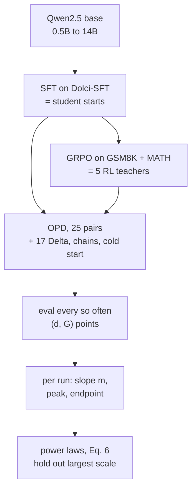
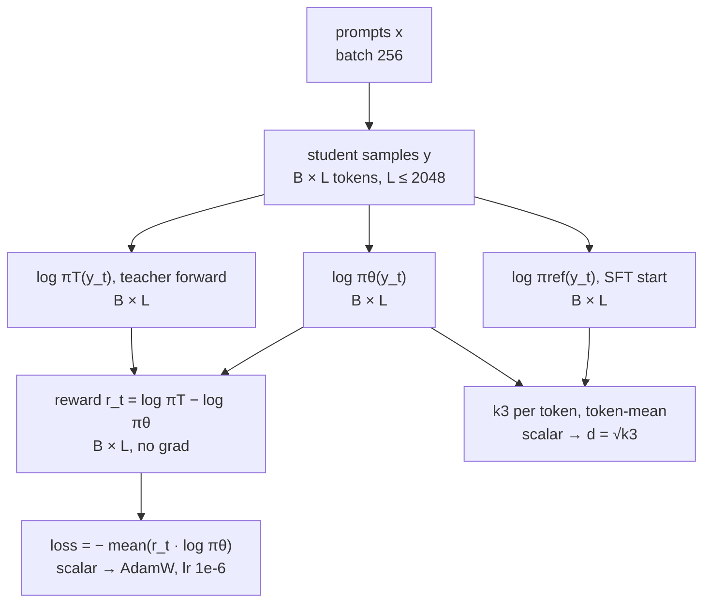

## Part I: Why should I care? { .rd-part }

## ⚡ The hook { #hook }

Take a tiny 0.5B-parameter language model and train it with reinforcement learning (RL) to solve school math. It gets good, for its size: **39.8%** on a held-out test (§6.3). Now let it *teach* a 14B model from the same family. The 14B student peaks at **77.7%**, almost double its teacher's score (Fig. 4).

So bigger teachers must be better? Not always. Give a 0.5B student a 3B teacher and it peaks at 40.8%. Give it a 14B teacher, far stronger, and it peaks *lower*, at 37.7% (§4).

So pick the teacher with the higher score? Also not always. A 1.5B teacher scoring 63.6% and a 3B teacher scoring 66.0% both teach a 7B student. The *lower*-scoring one wins, 77.5% vs 73.8% (Table 5).

Three surprises, and you'd only find each one after spending GPU-days training. This paper asks whether you can predict the outcome before training. Its answer is mostly yes, with one change of ruler and one power law. By the end you'll know the ruler, read the law, and know where it stops working.

## ⚡ The paper in one picture { #one-picture }

**One sentence.** In on-policy distillation, measure training progress in **√KL** instead of steps: accuracy then climbs in a straight line, and the student's peak follows a power law in which its error is roughly **the teacher's error, shrunk by a power of student size**, with the smaller teacher winning at equal score.

**One paragraph.** The authors build a 5 × 5 grid of Qwen2.5 math models (0.5B to 14B). Each size gets its own RL-trained teacher, and every teacher distils into every student with *on-policy distillation* (OPD): the student writes solutions and the teacher grades every token. They plot held-out accuracy (the **gold score** \(G\)) against \(d\), the square root of how far the student has drifted from its starting point, measured in KL. Every run starts with a straight line, then gets noisy (§4). The peak of each run fits a multiplicative power law in student size, teacher size and teacher score, which predicts held-out scales to within about 0.5–0.7 accuracy points (§5, Table 4). Side experiments test a different reward (Delta-OPD), an SFT warm-up, and chains of teachers (§6).

<figure class="rd-fig" markdown>
--8<-- "papers/2609.32722-opd-scaling/assets/one-picture.svg"
<figcaption><strong>What to notice:</strong> the same 39.8% expert lifts every bigger student far past its own score (numbers from Fig. 4 and §6.3). The middle panel is a sketch of the shape, not data. Only the straight first part is regular enough to model; the tail is not.</figcaption>
</figure>

## Primer: what you need first { #primer }

??? deep "Open the primer (skip if you ticked every prerequisite)"

    ### RL for LLM reasoning { #primer-rl }

    In LLM post-training, the language model is called a **policy** \(\pi_\theta\): given a prompt \(x\), it samples a response \(y\) one token at a time. One sampled response is a **rollout**.

    For math there's a cheap, exact reward: check the final answer. **RL with verifiable rewards** samples several rollouts per problem, rewards the correct ones, and nudges the policy toward them. The teachers in this paper are trained with **GRPO** (Group Relative Policy Optimization): sample a group of 8 rollouts per prompt, score each one relative to its group's average, and push up the better-than-average ones (§3, Table 8).

    Before RL, every model gets **SFT** (supervised fine-tuning on chat data) so it can follow a chat template (§3). So there are three checkpoints per size:

    | Checkpoint | Made by | Role in this paper |
    |---|---|---|
    | Base | Qwen2.5 pretraining | starting point |
    | SFT | fine-tuning on Dolci-SFT | **student** initialization \(\pi_{\mathrm{ref}}\); teacher's pre-RL copy \(\pi_{\mathrm{T}}^{\mathrm{base}}\) |
    | RL endpoint | GRPO on GSM8K+MATH, 580 updates | **teacher** \(\pi_{\mathrm{T}}\) |

    !!! bridge "Speech bridge"
        You've seen this loop in **minimum-WER (MWER) training** for ASR: decode an n-best list from the model, score each hypothesis against the reference, and push probability toward the low-WER ones. GRPO is the same idea, with "relative to the group mean" as the baseline. **Where it breaks:** MWER has a full reference transcript to compare every word against. Math RL only checks the *final answer*, so a 500-token chain of reasoning gets one bit of feedback.

    ### Distillation: off-policy vs on-policy { #primer-opd }

    **Off-policy distillation** is SFT on the teacher's outputs: the teacher writes solutions and the student maximizes their likelihood (Eq. 4). It's simple, but the student only ever practises continuing *teacher-written* prefixes. At test time it continues its own, mistakes included. This mismatch is called **exposure bias**.

    **On-policy distillation (OPD)** flips it. The *student* writes a solution, and the *teacher* scores every token the student actually sampled. The per-token reward is how much more the teacher likes that token than the student does:

    \[
    r_t = \log \pi_{\mathrm{T}}(y_t \mid x, y_{<t}) - \log \pi_\theta(y_t \mid x, y_{<t})
    \]

    <figure class="rd-fig" markdown>
    --8<-- "papers/2609.32722-opd-scaling/assets/onoff.svg"
    <figcaption><strong>What to notice:</strong> on-policy, the teacher never writes anything. It only grades the student's own tokens, so feedback lands exactly where the student goes wrong (the made-up "12" gets −2.3). The reward numbers are illustrative.</figcaption>
    </figure>

    !!! bridge "Speech bridge"
        Off- vs on-policy is **teacher forcing vs scheduled sampling** in a seq2seq ASR decoder, and **sequence-level KD** (Kim & Rush, 2016) from Whisper-large transcripts is the off-policy version of distillation. **Where it breaks:** scheduled sampling still trains toward a fixed ground-truth transcript. In OPD there's no ground truth at all, just a teacher's opinion of each next token, and that opinion can be wrong.

    ### Reverse KL, the k3 estimator, and why √KL { #primer-kl }

    **KL divergence** \(\mathrm{KL}(p\,\|\,q) = \sum_v p(v)\log\frac{p(v)}{q(v)}\) measures how surprised you'd be to see samples from \(p\) if you expected \(q\). It's zero when the two match and grows as they separate. **Reverse KL** \(\mathrm{KL}(\pi_\theta\|\cdot)\) takes the expectation under the *student's own* samples, which is exactly what you have during on-policy training.

    The paper uses KL in two places:

    1. **As the training objective**: student vs teacher (Eq. 1). Minimizing it makes the student more like the teacher.
    2. **As a ruler**: student now vs student at the start, \(\mathrm{KL}(\pi_\theta\|\pi_{\mathrm{ref}})\). It measures how far training has moved the model (§3).

    The ruler is estimated with **k3** (Eq. 5): for each sampled token, let \(\delta_t = \log\pi_{\mathrm{ref}}(y_t) - \log\pi_\theta(y_t)\) and average \(e^{\delta_t} - \delta_t - 1\) over the tokens. It's never negative, and it's unbiased because \(\mathbb{E}_{\pi_\theta}[e^{\delta}] = 1\) (Eq. 10). *Tiny example:* if a sampled token's log-prob went up by 0.2 relative to the start, \(\delta = -0.2\) and that token contributes \(e^{-0.2} + 0.2 - 1 = 0.0187\) nats.

    **Why the square root?** For small moves, KL grows like *distance squared*. Take a yes/no choice that starts at 50/50:

    | Move probability to | KL from 50/50 (nats) | √KL |
    |---|---|---|
    | 0.6 | 0.0201 | 0.142 |
    | 0.7 | 0.0823 | 0.287 |
    | 0.8 | 0.1927 | 0.439 |

    Doubling the move (0.1 → 0.2) multiplies KL by about 4 but √KL by about 2. So √KL behaves like a distance, which is why the paper calls \(d = \sqrt{k_3}\) "training progress" (§3). A typical useful-transfer phase ends around \(d \approx 0.3\), that is, about 0.09 nats per token (§5).

    ### Weak-to-strong supervision { #primer-w2s }

    Normally the teacher is bigger. **Weak-to-strong** flips that: a smaller or weaker supervisor trains a stronger model, and the question is whether the student can end up *better* than its supervisor. Burns et al. (2024) showed it often can, because the strong model already has latent knowledge that weak labels merely *elicit* (§7, App. C).

    This paper studies three setups (Fig. 1): **weak-to-strong** (teacher smaller than student), **same-base** (the teacher is the student's own size after RL), and **strong-to-weak** (classic distillation).

    !!! bridge "Speech bridge"
        **Noisy-student pseudo-labelling** is the speech version: a smaller ASR model transcribes unlabelled audio, a bigger model trains on those transcripts and beats its teacher. **Where it breaks:** pseudo-labels are fixed once generated. In weak-to-strong OPD the weak teacher grades the strong student's *current* outputs every step, so the supervision changes as the student does (App. C).

    ### Power laws, gold scores and proxies { #primer-laws }

    A **power law** \(y = A x^{-\alpha}\) is a straight line on log-log axes: every 10× in \(x\) multiplies \(y\) by the same factor, \(10^{-\alpha}\). Scaling-law papers usually model **remaining error** \(1 - G\) rather than accuracy, because error can keep shrinking toward zero while accuracy is capped at 100%.

    *Tiny example (Eq. 18, the paper's SFT baseline):* \(1 - G_{\mathrm{SFT}} = 0.682\,\widetilde N_S^{-0.326}\). For a 0.5B model, \(0.5^{-0.326} = 1.254\), so error is 0.855 and accuracy is 14.5%. For 14B, \(14^{-0.326} = 0.423\), so accuracy is 71.1%.

    The other idea comes from **reward-model overoptimization** (Gao et al., 2023). When you optimize against a *proxy* reward (a learned reward model), the true **gold** score first rises, then falls as the policy learns to exploit the proxy. Gao et al. plotted gold reward against √KL from the initial policy and found clean functional forms. This paper borrows that frame wholesale: the teacher's token reward is the proxy, and held-out test accuracy is the gold score (§1, §3).

    !!! bridge "Speech bridge"
        WER vs hours of training data roughly follows a power law, which is why "10× more data buys about the same relative WER cut each time" is a rule of thumb. **Where it breaks:** WER floors out at label noise and speaker or channel mismatch. The paper tested for an error floor here and found the fitted floor term went to zero over its range (App. H, Sensitivity).

## The problem { #problem }

You have a model family and an RL expert at one size. You want the RL skill at every other size without paying for RL at every size. Which teacher should each student learn from, and how good will the student get?

The obvious rules of thumb all fail somewhere on the paper's own grid:

<figure class="rd-fig" markdown>
--8<-- "papers/2609.32722-opd-scaling/assets/grid.svg"
<figcaption><strong>What to notice:</strong> read across the top row. The 0.5B student does best with the 3B teacher and gets <em>worse</em> as teachers grow past that. Read down any column: bigger students always win. (Peak gold scores in %, transcribed from the cell labels of Fig. 4, left; one run per cell.)</figcaption>
</figure>

| Rule of thumb | Where it breaks (pointer) |
|---|---|
| "Bigger teacher, better student" | The 0.5B student peaks at 40.8% with a 3B teacher, 39.0% with 7B and 37.7% with 14B (§4); the 3B student prefers the 3B teacher to the 7B (§4.1). |
| "Higher-scoring teacher, better student" | A 3B checkpoint scoring 66.0% teaches a 7B student to 73.8%; a 1.5B teacher scoring 63.6% gets it to 77.5% (Table 5). |
| "Chain it: small → medium → large" | Every bootstrapped chain peaks below direct OPD from the 0.5B expert (§6.3). |
| "Warm up with SFT on teacher samples first" | Costs a 14B student 19.4 points when the teacher is the 0.5B expert (§6.2). |
| "Train for N steps" | The step where accuracy peaks differs by pair. Even in KL terms, the 7B student's peak sits at \(d\) from 0.274 to 0.323 depending on the teacher (§4.1). |

!!! paper "The paper says (§1)"
    The central question is whether the outcome student's performance can be estimated from teacher and student scale *before* running OPD. If the dependencies had a law-like form, an OPD run "could be predicted rather than discovered after training."

!!! take "Our take"
    The practical stake is **amortization**: RL is the expensive, finicky part of post-training. If one small RL expert can be distilled predictably into every larger sibling, you run RL once. That's the weak-to-strong direction, and it's where most of this paper's surprises live.

!!! predict "Pause and predict"
    Look at the grid's diagonal (same-base: each student taught by an RL'd copy of itself). Direct RL on the student is the obvious alternative to distilling from that copy. Guess: is same-base OPD clearly worse than direct RL, about equal, or clearly better?

    ??? answer "Reveal"
        **About equal.** Same-base Vanilla-OPD peaks land within 0.5 points of the direct-RL endpoint at all five sizes and beat it at three (§4.1). The tempting guess is "worse, because distillation loses something". But the teacher *is* the RL endpoint at the same size, so OPD mostly re-traces the RL policy's moves. The interesting cases are off the diagonal.

So the grid has structure, but not the structure the rules of thumb predict. What ruler and what law make it regular?
{ .rd-next }

## Part II: What and how { .rd-part }

## ⚡ The big idea { #big-idea }

Two moves, one per half of the paper.

**1. Change the ruler.** Don't plot accuracy against optimizer steps; plot it against \(d = \sqrt{\mathrm{KL}(\pi_\theta\|\pi_{\mathrm{ref}})}\), how far the student has moved from where it started. On that axis every one of the 25 runs begins with a **straight line** (\(R^2\) from 0.932 to 0.988 on the first 30 checkpoints, §4). There's a reason: accuracy changes to *first* order in a small parameter step, but KL changes to *second* order, so accuracy is linear in √KL (App. D).

**2. Predict the peak from three numbers.** The best accuracy a student reaches obeys

\[
\underbrace{1 - G_{\text{peak}}}_{\text{student error}} \;\approx\; 0.97\;\underbrace{(1 - G_T^{\text{eff}})^{0.95}}_{\text{teacher error}}\;\underbrace{\widetilde N_S^{-0.30}}_{\text{shrunk by student size}}\;\underbrace{(\widetilde N_T^{\text{eff}})^{+0.27}}_{\text{bigger teacher: a bit worse}}
\]

(Eq. 6 with the Vanilla-OPD coefficients of Table 1). With an exponent near 1, **student error is roughly proportional to teacher error**, scaled down by student size. The surprising part is the last factor: *at the same teacher score*, a bigger teacher leaves more error. A teacher bigger than the student is capped at the student's size, so it adds nothing (§5).

The memorable version: **"Straight in √KL; the student shrinks the teacher's error."**

!!! bridge "Speech bridge"
    You already measure adaptation "distance" when you fine-tune an ASR model with a KL penalty to the original, to keep it from forgetting. This paper says: use that same KL from the start as the **x-axis** of your learning curve. Runs that took very different numbers of steps line up once you plot them by how far the model actually moved. **Where it breaks:** here KL is measured on the model's own samples, which change as it trains. An ASR KD loss is usually computed on a fixed dataset.

!!! predict "Pause and predict"
    The teacher-error exponent is about 0.95. Suppose you swap a teacher with 40% error for one with 20% error, keeping both sizes fixed. Roughly what happens to the student's error?

    ??? answer "Reveal"
        It roughly **halves**: \((0.2/0.4)^{0.95} = 0.517\). With the exponent near 1, halving the teacher's mistakes halves the student's. The common wrong guess is "a little better", which is what you'd expect if the student's own size dominated. It doesn't: teacher error enters almost linearly, while student size enters as a gentle −0.30 power.

## How it works { #how-it-works }

This is an empirical study, so "how it works" means how the experiment is built, what's measured, and how the laws are fitted.

### Start from the simplest version

**Naive study: run OPD for every teacher–student pair for a fixed number of steps and record the final accuracy.** It breaks four ways, and each fix is part of the paper's design.

1. **Final accuracy is the wrong number.** Many runs peak and then *regress* (§4). → *Fix: record the peak \(G_{\text{peak}}\), the initial slope \(m\), and where the straight part ends, \(d_{\text{transfer}}\).*
2. **Steps are the wrong ruler.** Different pairs move at different speeds per optimizer step, and in the paper's own early runs, sequence-level KL didn't line them up either (App. K). → *Fix: index progress by \(d = \sqrt{\text{token-mean reverse KL}}\).*
3. **Teacher size alone doesn't describe a teacher.** An undertrained teacher scores below its size trend (§5). → *Fix: add the teacher's own gold score as a covariate.* But on the RL-endpoint grid, teacher size and teacher score move together almost perfectly (correlation \(r = -0.9999\), §5), so the data can't tell their effects apart. → *Fix: add teachers that are off the size trend (OPD products from the bootstrapping chains), which brings the correlation down to −0.95 (Vanilla) and −0.97 (Delta) (§5, App. H).*
4. **Huge teachers stop helping small students.** → *Fix: cap the teacher's size at the student's, \(\widetilde N_T^{\text{eff}} = \min(N_T, N_S)/1\text{B}\) (§5).*

### ⚡ The core loop in five steps { #core-loop }

1. **Build the family.** SFT every Qwen2.5 base model (0.5B, 1.5B, 3B, 7B, 14B), then GRPO each on 14.8K GSM8K+MATH training problems to get five RL-expert teachers (§3).
2. **Distil every pair.** Run Vanilla-OPD for all 25 teacher–student combinations, up to 580 updates (10 epochs), on the same training prompts (§3).
3. **Log two numbers per checkpoint.** Gold score \(G\) on the 6.3K held-out test problems, and \(d = \sqrt{k_3}\), the student's drift from its own SFT start (Eq. 5).
4. **Read each curve.** Fit a line \(G = c + m\,d\) to the first 30 checkpoints, and record the slope \(m\), the peak \(G_{\text{peak}}\), and where the curve leaves the line, \(d_{\text{transfer}}\) (§4).
5. **Fit laws across pairs.** Regress \(1 - G_{\text{peak}}\) and \(m\) on student size, capped teacher size and teacher error (Eq. 6), then test them by refitting without the largest student or teacher and predicting it (§5, Table 4).

<figure class="rd-fig" markdown>



<figcaption><strong>What to notice:</strong> the SFT checkpoint plays two roles. It is every student's starting point (and its KL reference), and it is the pre-RL copy of every teacher, which Delta-OPD needs.</figcaption>
</figure>

### What one OPD update computes

The paper's training runs use the verl framework with batch size 256 and responses up to 2,048 tokens (Table 9). Here are the tensors in one Vanilla-OPD step, with \(B\) sampled responses of length up to \(L\):

<figure class="rd-fig" markdown>



<figcaption><strong>What to notice:</strong> the teacher costs one extra forward pass over the student's tokens and never generates anything. The KL ruler (right branch) is logged, not optimized, in Vanilla-OPD. The paper doesn't list how many rollouts it samples per prompt; B is that number times 256.</figcaption>
</figure>

### The training signal, decoded (Eq. 2)

\[
\max_\theta\; \mathbb{E}_{x\sim\mathcal D,\; y\sim\pi_\theta(\cdot|x)}\Big[\sum_{t=1}^{|y|} \underbrace{\log\pi_{\mathrm T}(y_t|x,y_{<t}) - \log\pi_\theta(y_t|x,y_{<t})}_{A_t^{\mathrm V}}\Big] \qquad \text{(Eq. 2)}
\]

| Symbol | Meaning |
|---|---|
| \(x\), \(\mathcal D\) | a training prompt and the prompt distribution (the 14.8K math problems) |
| \(y\), \(y_t\), \(y_{<t}\) | a student rollout, its token \(t\), and the prefix before it |
| \(\pi_\theta\) | the student being trained |
| \(\pi_{\mathrm T}\) | the frozen RL teacher |
| \(A_t^{\mathrm V}\) | the advantage given to token \(t\): just its own immediate reward |

**In words.** Sample from the student. For each token it chose, ask "does the teacher like this more than you do?" Push up the ones where the answer is yes and push down the others. Strictly, minimizing sequence-level reverse KL (Eq. 1) would credit each token with the sum of all *future* rewards too. Modern recipes drop that and use only the immediate reward, called a *zero-discount* update (§2, after Lu and Thinking Machines Lab, 2025).

**Tiny example.** The student writes "2x = 12" where the right step is "2x = 10".

| Token | \(\pi_\theta\) | \(\pi_{\mathrm T}\) | \(A_t = \ln\pi_{\mathrm T} - \ln\pi_\theta\) |
|---|---|---|---|
| "=" | 0.90 | 0.90 | 0.00: agree, no push |
| "12" | 0.40 | 0.04 | \(\ln 0.04 - \ln 0.40 = -2.30\): pushed down hard |

Averaged over many samples, \(-A_t\) equals the full reverse KL between student and teacher at that prefix (§2). The paper estimates it from the sampled token alone (*sampled-token estimation*) instead of summing over the whole vocabulary, and App. K explains why: the full-vocabulary loss made weak-to-strong regression start earlier and hit harder.

### Delta-OPD: copy the teacher's *change*, not the teacher (Eq. 3)

\[
A_t^{\Delta} = \log\pi_{\mathrm T}(y_t|\cdot) - \log\pi_{\mathrm T}^{\text{base}}(y_t|\cdot), \qquad
\max_\theta\;\mathbb{E}\Big[\sum_t A_t^{\Delta} - \mathrm{KL}\big(\pi_\theta(\cdot|x,y_{<t})\,\|\,\pi_{\mathrm{ref}}(\cdot|x,y_{<t})\big)\Big] \qquad \text{(Eq. 3)}
\]

| Symbol | Meaning |
|---|---|
| \(\pi_{\mathrm T}^{\text{base}}\) | the teacher's own SFT checkpoint, *before* RL |
| \(\pi_{\mathrm{ref}}\) | the student's SFT checkpoint (its starting point) |
| \(A_t^\Delta\) | how much RL changed the teacher's opinion of this token |

**In words.** Vanilla says "be like the teacher". Delta says "move the way RL moved the teacher", and a KL term keeps the student near its own start. Everything the teacher already believed before RL (its style, its blind spots from being small) cancels out of the reward. This contrast is the shared core of OPD², Direct-OPD and W2S-OPD (§2, §7).

**Tiny example.** The student samples "12". Before RL the teacher gave it 0.30; after RL, 0.03. So \(A^\Delta = \ln 0.03 - \ln 0.30 = -2.30\): RL learned that "12" is wrong here. For a formatting token that RL didn't touch (0.95 before and after), \(A^\Delta = 0\), *even if the student's own probability differs a lot*. Vanilla would push the student toward the small teacher's formatting habits; Delta doesn't.

### The ruler, decoded (Eq. 5)

\[
k_3 = \mathbb{E}_{x,\;y\sim\pi_\theta}\Big[\tfrac{1}{|y|}\sum_t e^{\delta_t} - \delta_t - 1\Big], \quad \delta_t = \log\pi_{\mathrm{ref}}(y_t|\cdot) - \log\pi_\theta(y_t|\cdot), \qquad d = \sqrt{k_3} \qquad \text{(Eq. 5)}
\]

**In words.** Over the student's own samples, average a per-token "how far has this token's probability moved since the start" score. Dividing by \(|y|\) makes it a per-token average, so long answers don't count more (§3).

**Tiny example.** A 3-token response where the student now gives the tokens log-probs 0.1 higher, 0.0, and 0.3 lower than at the start: \(\delta = (-0.1, 0, +0.3)\). Per-token terms: \(e^{-0.1}+0.1-1 = 0.0048\); \(0\); \(e^{0.3}-0.3-1 = 0.0499\). Mean = 0.0182, so \(d = 0.135\).

Why per-token and not per-sequence? The zero-discount objective controls each *next-token* distribution, not the joint sequence. The authors first tried sequence-level KL, following Gao et al., and the early regime wasn't consistently regular (App. K).

### Why the start is a straight line (Eq. 8)

Take a small training step of size \(\tau\) in direction \(h\). Accuracy changes in proportion to \(\tau\) (first order), but KL from the start changes in proportion to \(\tau^2\), because KL is zero with zero slope at the starting point (Eq. 13). So \(d = \sqrt{\mathrm{KL}} \propto \tau\), and accuracy is linear in \(d\):

\[
G(d) = G_0 + m\,d + O(d^2), \qquad m = \sqrt 2\;\frac{g_0^\top h}{\sqrt{h^\top F_{\text{tok}}\,h}} \qquad \text{(Eq. 8)}
\]

| Symbol | Meaning |
|---|---|
| \(g_0\) | gradient of expected accuracy at the start: the direction that would raise accuracy fastest |
| \(h\) | the direction training actually moves the parameters (set by the OPD reward and the optimizer) |
| \(F_{\text{tok}}\) | the token-averaged Fisher matrix: how much each parameter direction changes the output distribution |
| \(m\) | the slope: accuracy gained per unit of √KL spent |

**In words.** The slope is "how well aligned is the update with the accuracy gradient, per unit of distribution change". A reward that moves the model in directions that change many token probabilities but barely affect correctness has a shallow slope. That's the lens for Delta vs Vanilla: same exponent, different alignment (App. D.3).

**Tiny example.** Say \(g_0^\top h = 0.5\) and \(h^\top F h = 8\). A step \(\tau = 0.1\) raises accuracy by \(0.05\) and creates KL \(= \tfrac12 (0.1)^2 \cdot 8 = 0.04\), so \(d = 0.2\). Slope \(= 0.05/0.2 = 0.25\), and the formula gives \(\sqrt2 \cdot 0.5/\sqrt8 = 0.25\). ✓

??? deep "Deep dive: the derivation in four lines (App. D.2)"
    1. Path: \(\theta(\tau) = \theta_0 + \tau h + O(\tau^2)\) (Eq. 11).
    2. The conditional KL from \(\pi_{\mathrm{ref}}\) is 0 at \(\theta_0\), its gradient is 0, and its Hessian is the Fisher matrix (the classic TRPO fact, Schulman et al., 2015). So \(D_{\text{tok}}(\theta(\tau)) = \tfrac{\tau^2}{2} h^\top F_{\text{tok}} h + O(\tau^3)\) (Eq. 13). The prefix distribution also drifts, but that's an \(O(\tau)\) change multiplying an \(O(\tau^2)\) KL, so it only adds \(O(\tau^3)\).
    3. Smoothness of expected accuracy: \(G(\theta(\tau)) = G_0 + \tau\, g_0^\top h + O(\tau^2)\) (Eq. 14).
    4. Invert \(d = \tau\sqrt{h^\top F h/2} + O(\tau^2)\) and substitute into step 3 to get Eq. 8.

    If \(g_0^\top h = 0\), the linear term vanishes and gains would start *quadratic* in \(d\). The theorem fixes only the exponent as \(d \to 0\). How long the line lasts, and what happens after, is purely empirical (App. D.4).

### Where the straight part ends

The **transfer endpoint** \(d_{\text{transfer}}\) is the last \(d\) before the curve drops below the 95% predictive band of its initial line for **three checkpoints in a row** (§4). It's a "when does my forecast stop working" rule, not a fitted kink. Under it, 9 of the 25 Vanilla runs leave the line within the observed training; varying the band (90–99%) and persistence (2–4) gives 8 to 12 (Table 17). The rest are *right-censored*: they never left the line before training stopped.

### The peak law, decoded (Eq. 6)

\[
1 - G_{\text{peak}} = A\,\widetilde N_S^{-\alpha}\,(\widetilde N_T^{\text{eff}})^{-\beta}\,(1 - G_T^{\text{eff}})^{\zeta}, \qquad
m = B\,\widetilde N_S^{-\gamma}\,(\widetilde N_T^{\text{eff}})^{\delta}\,(1 - G_T^{\text{eff}})^{-\xi} \qquad \text{(Eq. 6)}
\]

| Symbol | Meaning | Vanilla | Delta |
|---|---|---|---|
| \(\widetilde N_S\) | student parameters ÷ 1B | | |
| \(\widetilde N_T^{\text{eff}}\) | \(\min(N_T, N_S)\) ÷ 1B: teacher size, capped at the student's | | |
| \(G_T^{\text{eff}}\) | the (capped) teacher's own gold score | | |
| \(A\) | overall scale | 0.97 | 1.02 |
| \(\alpha\) | student-size exponent (bigger student, less error) | 0.30 | 0.34 |
| \(\beta\) | teacher-size exponent; **negative**, so bigger teacher at fixed score means *more* error | −0.27 | −0.33 |
| \(\zeta\) | teacher-error exponent | 0.95 | 1.01 |
| \(B, \gamma, \delta, \xi\) | the same roles for the initial slope \(m\) | 0.12, 0.19, −0.61, 1.90 | 0.13, 0.20, −0.73, 2.01 |

(Coefficients from Table 1; Table 16 gives three decimals and 95% bootstrap intervals, e.g. Vanilla \(\zeta = 0.952\;[0.898, 1.035]\), \(\beta = -0.267\;[-0.311, -0.229]\).)

**Watch the sign.** The law writes \((\widetilde N_T^{\text{eff}})^{-\beta}\) with \(\beta = -0.27\), so the teacher-size factor is \((\widetilde N_T^{\text{eff}})^{+0.27}\). Read it as: *holding teacher score fixed*, a 2× bigger teacher multiplies the student's error by \(2^{0.27} \approx 1.20\).

**Why multiplicative?** Each factor removes a *fraction* of whatever error the others leave: a bigger student cuts a constant fraction of the teacher-induced error. An additive law would instead predict a teacher-induced error that never goes away however big the student gets, and it fits worse (§5, Table 12).

**Tiny example, by hand.** 7B student, 1.5B RL-endpoint teacher scoring 63.6%:

- student factor \(7^{-0.304} = 0.553\);
- teacher-size factor \(1.5^{0.267} = 1.114\);
- teacher-error factor \(0.364^{0.952} = 0.382\);
- \(1 - G_{\text{peak}} = 0.97 \times 0.553 \times 1.114 \times 0.382 = 0.229\), so \(G_{\text{peak}} \approx 77.1\%\).

The paper's joint-law prediction is 77.1 and the observed peak is 77.5 (Table 5).

**The rate law** has the same shape with stronger teacher-error dependence (\(\xi \approx 2\)): a worse teacher slows transfer much more than it lowers the eventual peak. At equal score, the bigger teacher transfers more slowly too (\(\delta < 0\)). But the rate fits are loose (log-space \(R^2\) of 0.59 and 0.76), and a plain affine model with the same covariates predicts held-out slopes slightly better (§5, App. H). Treat the rate law as a summary, not a forecaster.

<div class="rd-widget" id="opd-law" role="group" aria-label="Peak-law explorer: choose student size, teacher size and teacher score, and see the predicted peak accuracy"><noscript>This widget needs JavaScript.</noscript></div>
<script src="assets/widget-law.js"></script>
<p class="rd-widget-caption"><strong>Try this:</strong> load "1.5B endpoint → 7B", then "3B step-58 checkpoint → 7B". The orange dot moves right (the teacher scores higher) but <em>down</em> (the law predicts a worse student), because it jumps from the 1.5B line to the lower 3B line. Then set the teacher to 14B with the 0.5B student: nothing changes, because the cap kicks in. (Coefficients from Table 16; open circles are observed Vanilla peaks from Fig. 4, Table 5 and §6.3.)</p>

!!! predict "Pause and predict"
    Teacher size and teacher score were correlated at \(r = -0.9999\) on the RL-endpoint grid (§5). Suppose the authors had fitted Eq. 6 on that grid alone. What would you expect from the fitted \(\beta\) and \(\zeta\)?

    ??? answer "Reveal"
        **Garbage, or at least unstable, values.** When two inputs move in lockstep, a regression can trade one exponent off against the other almost for free: many \((\beta, \zeta)\) pairs fit equally well. That's exactly why the paper says the exponents "cannot be separated there" and brings in the chain teachers, whose scores sit below the size trend, to break the tie (§5). Fig. 17 (third column) shows the bootstrap exponents still lying on an anticorrelated ridge, just one that now excludes zero. The tempting answer, "they'd just both come out a bit noisier", understates it.

### Pseudocode

=== "The study"

    ```text
    for N in [0.5, 1.5, 3, 7, 14]B:
        sft[N]     = SFT(QwenBase[N], Dolci-SFT subset)          # Table 7
        teacher[N] = GRPO(sft[N], GSM8K+MATH train, 580 updates) # Table 8
    for (S, T) in 5 × 5 grid:
        traj = OPD(student=sft[S], teacher=teacher[T], ref=sft[S])  # ≤ 580 updates
        points = [(sqrt(k3(ckpt, sft[S])), test_accuracy(ckpt)) for ckpt in traj]
        m, c   = linear_fit(points[:30])                        # §4
        G_peak = max(G for _, G in points)
        d_transfer = first d where 3 consecutive points fall below 95% band
    fit Eq. 6 on log(1 - G_peak) and log(m), adding the chain-teacher cells   # §5
    validate: leave one scale out; hold out the largest student / teacher      # Table 4
    ```

=== "One OPD update (Vanilla)"

    ```text
    x      = sample 256 prompts
    y      = student.generate(x, temperature=1, max_len=2048)   # on-policy
    lp_s   = student.logprob(y)            # B × L, with grad
    lp_t   = teacher.logprob(y)            # B × L, no grad
    adv    = (lp_t - lp_s).detach()         # zero-discount token reward, Eq. 2
    loss   = -(adv * lp_s).mean()           # policy gradient
    AdamW(lr=1e-6).step(loss)
    # Delta-OPD: adv = teacher.logprob(y) - teacher_base.logprob(y),
    #            plus a reverse-KL penalty to the student's SFT start (Eq. 3)
    ```

### One example by hand: the matched-score teacher

This is the paper's sharpest test (Table 5, Fig. 5). Two teachers for a 7B student:

- **A:** the 1.5B RL endpoint, scoring 63.6%.
- **B:** the 3B teacher's RL run stopped early, at step 58, scoring 66.0%.

B is bigger *and* scores higher. A size-only law and a score-only law both prefer B. Now run Eq. 6 for B:

1. Student factor: \(7^{-0.304} = 0.553\) (same as before).
2. Teacher-size factor: \(3^{0.267} = 1.341\) (vs 1.114 for A: **20% more error** from doubling teacher size).
3. Teacher-error factor: \(0.340^{0.952} = 0.358\) (vs 0.382 for A: **6% less error** from the better score).
4. \(1 - G = 0.97 \times 0.553 \times 1.341 \times 0.358 = 0.258\), so the prediction is **74.2%** with these rounded inputs (the paper's fit gives 74.1).

The size penalty outweighs the score bonus, so B should teach *worse*. Observed: **73.8% for B vs 77.5% for A**. That cell was held out of every fit (App. H).

<figure class="rd-fig" markdown>
--8<-- "papers/2609.32722-opd-scaling/assets/matched.svg"
<figcaption><strong>What to notice:</strong> in the middle row, the grey square and triangle (size-only, score-only laws) sit far right of the observed blue circle; only the orange diamond (joint law) lands on it. (All numbers from Table 5.)</figcaption>
</figure>

So we have a ruler and a law. Can a 50-line toy reproduce the ruler's straight line, and the student overtaking its teacher?
{ .rd-next }

## Build a toy version { #toy }

!!! take "Educational simplification"
    This toy keeps three things: sampling from the student, the zero-discount token reward \(\log\pi_{\mathrm T} - \log\pi_\theta\), and the k3 ruler. It drops everything else: there's no language model, answers are a single token out of 8, the "teacher" is a fixed table, and the student is a small hand-built model. That model has one **shared** parameter \(s\) that unlocks the student's latent knowledge across all prompts (our stand-in for "the strong student already knows things"), plus per-prompt logits that can memorize whatever the teacher says. This structure is **our construction** to make weak-to-strong possible; it's not from the paper, and it proves nothing about LLMs.

```python
--8<-- "papers/2609.32722-opd-scaling/assets/toy.py"
```

Real output (Python 3.10, PyTorch 2.13 CPU, 3.5 s):

```text
--8<-- "papers/2609.32722-opd-scaling/assets/toy_output.txt"
```

<figure class="rd-fig" markdown>
--8<-- "papers/2609.32722-opd-scaling/assets/toy-curve.svg"
<figcaption><strong>What to notice:</strong> the same run, two x-axes. Against steps (A) the early rise bends; against √KL (B) the first five points lie on one straight line. The peak (0.545) beats the teacher (0.511, dashed), then the student slides back toward the teacher. (Plotted from the toy's logged points above.)</figcaption>
</figure>

What the toy shows, and what it doesn't:

- **The ruler works here too.** Over steps 0–120, accuracy vs step fits a line with \(R^2 = 0.922\); the same points vs \(d\) give \(R^2 = 1.000\) (slope 0.626). That's Eq. 8 in action: early updates move along a nearly fixed direction, so gain per √KL is constant even when gain per step isn't.
- **Weak-to-strong, then regression.** The student peaks 3.4 points above its teacher, then loses most of it. In the toy the mechanism is visible: the shared \(s\) moves fast (generalization), and the per-prompt logits slowly copy the teacher's mistakes (over-imitation).
- **A twist the paper doesn't show.** In our toy the regression happens at almost constant \(d\) (0.35 → 0.34 and back): imitating the teacher's errors costs little *extra* KL. Don't read anything into that for LLMs. It shows that "distance moved" and "direction moved" are different things, which is why the paper models the peak *value* rather than its location (App. K).
- **What it can't show:** any scaling law. There's one "size" here. A toy scaling study would need students of several capacities, and we didn't build one (see the Brainstorm lab).

How well do the real laws hold up, and what do the side experiments say?
{ .rd-next }

## Part III: Does it actually work? { .rd-part }

## ⚡ The evidence { #evidence }

### What the numbers mean

- **Gold score \(G\)**: accuracy on the 6.3K held-out GSM8K+MATH test problems, one sample per problem at temperature 1.0 (Table 10, App. D.2 calls it "sampled mean@1"). Higher is better. With 6.3K problems, one evaluation has a sampling standard error of roughly ±0.5 points near 80% accuracy (our arithmetic).
- **\(d\)**: √(token-mean reverse KL from the student's SFT start). Typical useful-transfer ends between 0.20 and 0.36 (§5).
- **Slope \(m\)**: accuracy (as a fraction) per unit \(d\). Observed range 0.175–0.721 (§4).
- **LOSO RMSE (leave-one-scale-out)**: refit the law without every cell at one student (or teacher) size, predict those cells, and report the error in accuracy points. Lower is better.
- **Extrapolation RMSE (S / T)**: refit without the *largest* student (S) or teacher (T) and predict it. This is the honest test of a scaling law.

### How to read Table 4

Each method has three rows: a law with **sizes only** (Eq. 7), one with **teacher score only** (Eq. 19), and the **joint** law (Eq. 6). The argument lives in the first column: does adding teacher score to size help on held-out scales?

| Method | Law | LOSO RMSE | Extrapolate S / T |
|---|---|---|---|
| Vanilla-OPD | sizes only | 3.43 | 0.64 / 0.75 |
| | score only | 2.55 | 2.54 / 0.70 |
| | **joint** | **1.66** | **0.55 / 0.68** |
| Delta-OPD | sizes only | 2.47 | 0.21 / 0.29 |
| | score only | 2.07 | 0.93 / 0.46 |
| | **joint** | **0.82** | 0.20 / 0.32 |

(Accuracy points, Table 4.) Two things stand out. Adding teacher score halves the LOSO error. And extrapolation to the biggest held-out scale is within one point for every law except score-only: **the big-scale cells are easy to extrapolate to; the irregular small cells are what LOSO punishes.**

### Result 1: the straight line is universal, the tail isn't

All 25 Vanilla runs give first-30-checkpoint line fits with \(R^2 \in [0.932, 0.988]\) and RMSE of 0.26–1.29 accuracy points (§4). After the line: attenuated gains, saturation or regression, "with no shared functional form" (§4). In every panel, the smallest teacher shows the clearest regression (§4). Gao et al.'s overoptimization curves (\(ad - bd^2\), \(ad - bd\log d\)) didn't fit: their curvature terms weren't identifiable (App. K).

And the extent of the line is nearly **scale-free**: \(d_{\text{transfer}}\) stays within 0.20–0.36 (Vanilla) and 0.27–0.34 (Delta), medians 0.30 and 0.29 (§5). The fitted endpoint laws (Eq. 20) move the median budget by under 2× across the whole grid.

!!! paper "The paper says (§4.1, Fig. 12)"
    The teacher's implicit reward, logged as a proxy score \(P\), **keeps rising wherever gold score regresses**. That's the signature of overoptimizing the teacher-induced reward, not just "the student finished learning".

!!! take "Our take"
    App. A adds a caveat worth keeping: regression could also be plain **over-imitation** of a teacher that lacks some of the student's skills (exactly what our toy shows), and "collapse" would be a third thing. The rising-\(P\) evidence is consistent with overoptimization, but the paper doesn't run the fixed-prompt test it says would be needed to separate the first two (App. A, "Regression and overoptimization are not synonymous").

### Result 2: weak teachers lift strong students past themselves

In every weak-to-strong pair observed, the student's peak beats the teacher's own score (§5). The headline case is the 0.5B expert (39.8%) lifting 1.5B, 3B, 7B and 14B students to 53.0, 61.4, 72.7 and 77.7% (Fig. 4, §6.3). The margins shrink as the teacher's size approaches the student's (§5).

!!! predict "Pause and predict"
    The 14B student ends at 77.7% under the 0.5B expert (39.8%). Before distillation, after SFT only, is the 14B student closer to 40% or to 75%?

    ??? answer "Reveal"
        **Closer to 75%: about 72.6%** (peak 77.7 minus its 5.1-point gain, Table 11; our subtraction). Eq. 18's SFT baseline agrees, at about 71%. So this headline cell is mostly a strong student gaining 5 points from a weak teacher, not a weak teacher dragging a student up from 40%. The tempting guess, "near 40%, since it's learning from a 40% teacher", conflates the teacher's level with the student's starting point.

But how much of that is the student's own head start? Table 11 gives each Vanilla run's peak *gain* over its own starting accuracy, so peak − gain ≈ where the student started. **This subtraction is ours**, and starting accuracies are noisy single evaluations (§6.1):

| Pair (student ← teacher) | Teacher score | Student start ≈ peak − gain | Peak | Started below teacher? |
|---|---|---|---|---|
| 14B ← 0.5B | 39.8 | 77.7 − 5.1 = 72.6 | 77.7 | no, far above |
| 7B ← 0.5B | 39.8 | 72.7 − 11.7 = 61.0 | 72.7 | no |
| 3B ← 0.5B | 39.8 | 61.4 − 8.2 = 53.2 | 61.4 | no |
| 3B ← 1.5B | 63.6 | 70.7 − 17.6 = 53.1 | 70.7 | **yes**, ends 7.1 above |
| 7B ← 1.5B | 63.6 | 77.5 − 16.0 = 61.5 | 77.5 | **yes**, ends 13.9 above |
| 7B ← 3B | 73.6 | 80.3 − 20.2 = 60.1 | 80.3 | **yes**, ends 6.7 above |

The tiny-teacher cases are less magical than they look: a 14B SFT model already scores about 73% before any distillation. The genuinely striking cells are the bottom three, where the student **starts below the teacher and ends well above it**.

### Result 3: the law predicts held-out teachers, including a tricky one

The matched-score test (worked through above, Table 5) is the paper's best evidence that teacher size has its own *negative* effect at fixed score. And the bootstrapping chains (§6.3) show the same pattern in the wild: the 1.5B OPD product scores 53.0% vs the 0.5B expert's 39.8%, yet its 3B student peaks at 60.4% vs 61.4% from the 0.5B expert directly.

### Result 4: Delta-OPD transfers faster, mainly weak-to-strong

On 17 shared pairs, Delta-OPD's first-40-checkpoint lines fit with \(R^2 \in [0.916, 0.987]\) (§6.1). Its slope is steeper in 15 of 17 pairs, and its peak gain is larger in 12, nine of those weak-to-strong (Table 11, Fig. 9). The 0.5B teacher gives Delta 2–4 extra points of absolute peak; larger teachers stay within about a point (§6.1).

<div class="rd-widget" id="opd-delta" role="group" aria-label="Scatter of Delta-OPD against Vanilla-OPD for 17 teacher-student pairs, by slope or peak gain"><noscript>This widget needs JavaScript.</noscript></div>
<script src="assets/widget-delta.js"></script>
<p class="rd-widget-caption"><strong>Try this:</strong> on "Initial slope", almost every dot sits above the diagonal. Switch to "Peak gain": the blue (weak→strong) dots stay above, while green (same-base) and violet (strong→weak) dots hug the diagonal or dip below it. Highlight 14B ← 0.5B to see the biggest relative gap. (Numbers from Table 11.)</p>

!!! take "Our take"
    This fits Eq. 8's lens. Delta's reward cancels everything the small teacher believed *before* RL (its small-model style and gaps), so its update direction points more at "what RL learned" and less at "what makes you a 0.5B model". That would matter most when the teacher is much smaller than the student, which is where the gap is largest. It's our interpretation. The paper reports the pattern and calls it descriptive, noting more seeds are needed (App. A).

### Result 5: on-policy matters most where weak-to-strong is most tempting

<figure class="rd-fig" markdown>
--8<-- "papers/2609.32722-opd-scaling/assets/design.svg"
<figcaption><strong>What to notice:</strong> top, the SFT warm-up's damage grows with the size gap between student and the 0.5B teacher. Bottom, every chain (violet) lands left of direct transfer (blue). (Numbers from §6.2 and §6.3; the 7B chain bar spans the 70.0–71.3 range across chains.)</figcaption>
</figure>

- **Cold start hurts.** One epoch of SFT on the 0.5B expert's samples "pins every student near the teacher's own score", erasing 32 points of the 14B student's starting accuracy, and the following 580 OPD updates don't recover it (§6.2, Fig. 22).
- **Pure off-policy is worse still in weak-to-strong:** 28.4 points behind pure OPD in the most extreme cell, under one point behind in same-base cells (§6.2, Fig. 21).
- **Bootstrapping doesn't help:** 60.4 vs 61.4 at 3B, 70.0–71.3 vs 72.7 at 7B, 76.8 vs 77.7 at 14B, and longer chains end slightly lower (§6.3). Delta chains behave the same way (64.5 vs 65.3, 74.0 vs 75.0, 79.4 vs 79.9).
- **Direct RL on the student still wins** over every weak-teacher variant (§6.3). Weak-to-strong OPD's appeal is amortizing one expert, not beating RL.

!!! bridge "Speech bridge"
    The cold-start result is the LLM version of a trap you may know: fine-tune a strong ASR model on a *weaker* model's transcripts and it converges to the weaker model's error patterns. On-policy grading avoids this because the student keeps writing its own (better) hypotheses and only gets corrected token by token. **Where it breaks:** ASR pseudo-labels at least share the target's vocabulary and timing. Here SFT on teacher rollouts also imposes the small teacher's whole *reasoning style*, which is plausibly why the damage is so large (our interpretation).

### What the ablations and negative results prove

- **Multiplicative law beats additive** (LOSO RMSE 1.81/1.60 vs 1.97/1.76 for Vanilla), and an equal-weight additive law is far worse (4.02/2.67) (Table 12).
- **Capping the teacher helps**: uncapped teacher size or no teacher term predicts worse (App. H, Sensitivity).
- **No error floor needed**: a learnable irreducible-error term fits to zero (App. H).
- **The endpoint rule is robust**: 8–12 observed departures across nine band/persistence settings (Table 17).
- **Sequence-level KL doesn't expose the regular regime**; token-mean KL does (App. K).
- **Full-vocabulary KL loss accelerates weak-to-strong regression** compared with sampled-token policy gradient (App. K).
- **Optimizer precision changes the tail**: BF16 optimizer states (FSDP backend) hid post-peak regression that FP32 states (Megatron backend) showed reliably (App. K).

### What isn't shown

- **No seeds.** Every SFT, RL and OPD run is a single seed (App. E.5); the intervals are bootstrap over *cells*, not over training randomness (App. B).
- **The peak is chosen on the test set.** \(G_{\text{peak}}\) is the maximum held-out accuracy over many checkpoints, on the same 6.3K problems the laws are scored on. We found no separate validation split in the paper.
- **No compute numbers.** We found no GPU type or GPU-hours anywhere in the paper or appendix.
- **No contamination discussion.** We found no mention of contamination checks for GSM8K/MATH against Qwen2.5 pretraining.
- **One family, one task, ≤2K tokens** (App. B). The laws' coefficients are untested elsewhere.
- **Unspecified recipe details:** rollouts per prompt in OPD, evaluation frequency (so how many updates "30 checkpoints" spans), and the weight on Delta-OPD's KL term aren't stated. Table 9 lists only learning rate, batch size, epochs, max length and optimizer.

## Part IV: Think like a reviewer { .rd-part }

## Why this way and not another { #why-not }

<div class="rd-wide" markdown>

| Choice | Obvious alternatives | Why this one | What would likely happen otherwise | Evidence |
|---|---|---|---|---|
| x-axis = √(token-mean reverse KL from the student's start) | optimizer steps; sequence-level KL (Gao et al.) | KL is a model-independent "distance moved"; √ makes it linear (Eq. 8); token-mean matches the zero-discount objective | sequence KL gave an irregular early regime | 📄 App. K; steps: 🧠 reasoned (per-step speed differs by pair) |
| Model the **peak**, not the final or the peak's location | final accuracy; \(d_{\text{peak}}\) | runs regress, so final understates; \(d_{\text{peak}}\) is non-monotone (7B: 0.274 → 0.323) | no parametric law survived for \(d_{\text{peak}}\) | 📄 §4.1, App. K |
| Multiplicative law in remaining error | weighted or equal additive | each factor removes a fraction of the error left | additive fits worse on held-out scales | 📄 Table 12 |
| Cap teacher at student size | raw teacher size | saturation and reversal above student size (Fig. 4) | uncapped predicts worse; smallest students' reversals are still unmodeled | 📄 App. H, §5 |
| Add teacher score + chain-product teachers | size only; score only | size and score are collinear (\(r = -0.9999\)) on endpoints | exponents unidentifiable; size-only misorders the matched-score test | 📄 §5, Tables 4, 5 |
| Sampled-token policy-gradient loss | full-vocabulary reverse-KL loss | cheaper, and matches the field's recipe | weak-to-strong regression earlier and worse | 📄 App. K |
| Zero-discount (immediate) token reward | full return-to-go (exact gradient of Eq. 1) | what frontier pipelines use (§2) | unknown: not ablated | 🧠 reasoned; the laws may be recipe-specific |
| One seed per cell | 3+ seeds on fewer cells | compute; scaling studies rely on regularity across cells (App. E.5) | wider intervals but a seed-aware error bar | 📄 App. E.5 rationale; 🧠 for the cost |

</div>

**The decision that matters most is the ruler.** Everything downstream depends on it: the line fits, the slope \(m\), the endpoint budget, and the matched-KL comparison between Vanilla and Delta. App. C is careful that "matched KL" is *not* "matched compute": two objectives can spend KL at different rates per GPU-hour. So when the paper says Delta "converts KL into gold faster", that's a statement about efficiency per unit of *model change*, not per dollar.

## What's genuinely new { #novelty }

<figure class="rd-fig" markdown>
--8<-- "papers/2609.32722-opd-scaling/assets/lineage.svg"
<figcaption><strong>What to notice:</strong> the method pieces all exist by 2025. The paper's move is to aim Gao et al.'s 2023 measuring stick (blue) at OPD.</figcaption>
</figure>

**Borrowed:**

- The whole analytical frame (gold score vs √KL from init, coefficients predicted from scale) from Gao et al. (2023) (§1).
- Vanilla-OPD as practised (zero-discount, sampled-token) from Agarwal et al., Gu et al., and Lu & Thinking Machines (§2).
- Delta-OPD's reward from OPD², Direct-OPD and W2S-OPD (§2).
- The local KL ≈ Fisher quadratic from TRPO (App. D).
- Multiplicative fine-tuning laws (Zhang et al., 2024) and the "small teachers help, big ones saturate" pattern from pretraining distillation (Lu & Liu, 2026) (App. C).

**New:**

- A **measurement**: the first systematic teacher × student scale grid for OPD in all three directions, with every run read in the KL coordinate.
- The finding that the **early regime is linear in √KL** for OPD (where Gao's curvature forms don't apply), with a short proof of why the exponent is ½ (App. D).
- A **joint law with a negative teacher-size exponent**, identified by a trick: using OPD-product teachers to break the size–score collinearity, then confirmed on one held-out matched-score teacher (§5, Table 5).
- Clean **negative results**: cold-start SFT and teacher chains hurt weak-to-strong OPD (§6.2–6.3), the second reversing Burns et al.'s chess-puzzle finding.

!!! take "Why nobody did it before (our guess)"
    OPD only became a widespread post-training tool in 2025–26, and weak-to-strong OPD variants appeared mid-2026. A 25-cell grid up to 14B with RL teachers at every size is also expensive. It's the sort of study that becomes worth running only once enough people are making teacher-choice decisions.

## Reviewer's corner { #reviewer }

1. **"Students beat their teachers" is partly a head start.** As the Result 2 table shows (our subtraction from Table 11), big students distilled from the 0.5B expert *start* far above it. The 14B student starts around 72.6% vs the teacher's 39.8%. The claim is technically true but mixes two things: elicitation and pre-existing skill. The stronger evidence is the three cells that start below the teacher and finish above it; we'd have put those in the abstract.

2. **The peak is a maximum over noisy test evaluations, and the law is scored on that same test set.** Each evaluation is one temperature-1 sample per problem on 6.3K problems (Table 10), so maybe ±0.5 points of sampling noise at 80%. The maximum over many checkpoints is biased upward, and the bias grows with the number of evaluations. The headline extrapolation errors (0.55–0.75 points, Table 4) are the same size as this noise. That cuts both ways: the laws can't be shown to be more precise than ~1 point, and some "fit" may be fitting noise.

3. **The negative \(\beta\) rests on a handful of unusual teachers.** It's identified from 5 Vanilla (3 Delta) chain cells, whose teachers are OPD products, not RL endpoints (§5). A rival reading: "OPD-product teachers are worse teachers per point of score", not "bigger teachers are worse per point of score". The held-out Table 5 test (an *RL* checkpoint at step 58) supports the paper's reading, but it's one cell with one seed (App. B says as much).

4. **The cap is assumed, not derived.** \(\min(N_T, N_S)\) bakes in "no benefit above student size". The 7B row fits it (the 14B teacher adds just 0.3 points over the 7B one, Fig. 4), but the 0.5B and 1.5B rows actually *drop* with bigger teachers, and those drops are left as "unmodeled residuals" (§5). So the law has nothing to say about *why* a 14B teacher hurts a 0.5B student, which is one of the hook's surprises.

5. **The rate law is weaker than it reads.** Log-space \(R^2\) of 0.59 (Vanilla); the teacher-score exponent's interval is wide, \(\xi = 1.90\;[0.93, 2.84]\); and a raw-affine baseline beats it on held-out slopes (App. H). The abstract mentions slope laws alongside peak laws. Trust only the peak law for planning.

6. **The tail depends on numerics.** Whether runs regress at all changed with optimizer-state precision, BF16 vs FP32 (App. K). Since \(G_{\text{peak}}\) for regressing runs is set by where the tail turns over, the peak law implicitly depends on the backend. The authors fixed one backend, which is right, but it limits how far the coefficients transfer.

7. **Evaluation length and data.** Responses are capped at 2,048 tokens for RL, OPD and evaluation (Tables 8–10), well below modern long-reasoning budgets, and rollout length is known to affect OPD stability (App. B, citing Li et al. 2026b). We found no contamination discussion for GSM8K/MATH.

!!! take "Steelman: the two strongest criticisms"
    **Criticism (2): the peak-selection bias.** → *Likely response:* the bias affects every cell similarly (same test set size, similar checkpoint counts), so it shifts the law's intercept \(A\) more than the exponents. The held-out scales were predicted by the same procedure, so the extrapolation test is apples to apples. → *Where that leaves us:* fair for ranking teachers; less fair for promising "you'll get 77.1%". A separate validation split for picking the checkpoint would fix it cheaply.

    **Criticism (3): \(\beta\) from odd teachers.** → *Likely response:* that's why they ran Table 5 with an RL checkpoint, a teacher of the same kind as the grid but off the size trend, and the joint law ordered it correctly when both alternatives didn't. → *Where that leaves us:* the direction of the effect is plausible and once confirmed; its *size* (\(\beta = -0.27\) vs, say, −0.1) is poorly pinned. A few more matched-score checkpoints (cheap: they're already saved during RL) would settle it.

## Scope and boundaries { #scope }

<figure class="rd-fig" markdown>
--8<-- "papers/2609.32722-opd-scaling/assets/scope.svg"
<figcaption><strong>What to notice:</strong> all evidence sits in the small green square (25 grid cells, plus chains and one checkpoint test). The paper's "train RL once, distil predictably" pitch lives at frontier scale, top right, where there's no data.</figcaption>
</figure>

**Where it works (tested):** Qwen2.5 base 0.5B–14B; SFT on Dolci-SFT then GRPO on GSM8K+MATH; math word problems with exact-answer checking; responses ≤2K tokens; Vanilla and Delta OPD with a fixed recipe (lr 1e-6, batch 256, ≤580 updates); one seed per cell (§3, App. B, App. E).

**Where it probably breaks:**

- **Across families** (e.g. a Llama teacher for a Qwen student). "Same-family" is in the title for a reason: Vanilla's reward includes the teacher's whole token distribution, and cross-family tokenizers and styles would add huge, accuracy-irrelevant KL. 🧠
- **Long-horizon reasoning** (8K–32K tokens). Errors compound over longer rollouts, and the paper flags rollout length as a fixed but influential variable (App. B). 🧠
- **Tasks without a sharp gold metric** (open-ended chat, code style). The gold score anchors everything here. 🧠
- **Teachers much bigger than students.** The law caps them away instead of modelling the drop (§5).
- **Different optimizer numerics.** Tail behaviour, and thus the peak, can change (App. K).

**What it assumes about resources:** RL teachers at several sizes (or at least one plus checkpoints), the ability to run the teacher forward on every student rollout, and periodic full test-set evaluation to find the peak. The paper doesn't report compute; a 25-cell grid up to 14B with 580 updates each is, our guess, many thousands of GPU-hours. 🧠

## Part V: Beyond the paper { .rd-part }

## Applications { #applications }

- **Post-training a model family.** Run RL once on a mid-size sibling, then distil up and down with OPD. Use Eq. 6 to forecast each student's peak and to decide whether a bigger expert is worth training. That's the paper's own pitch (§8). 🧠 on the planning use.
- **Choosing among saved teacher checkpoints.** The matched-score result says: among checkpoints with similar scores, prefer the *smaller* model. Among checkpoints of the same model, the score factor dominates.
- **A KL budget as a stopping rule.** Since useful transfer ends around \(d \approx 0.3\) almost independent of scale (§5), logging k3 gives you a scale-free "start watching for regression now" signal, cheaper than evaluating the full test set every step. 🧠
- **Unexpected: speech LLMs and spoken-dialogue models.** A small model RL'd for, say, accurate number or entity transcription could OPD-supervise a much larger speech LLM's text decoding on its own hypotheses. It might work because the target (exact token correctness) is as sharp as math answers. 🧠
- **Unexpected: oversight.** App. A speculates that if this regularity holds at frontier scale, a fixed weak supervisor (even human-level) might elicit capability beyond itself through OPD. It's an extrapolation far outside the tested square. 📄 App. A, flagged by us as speculative.

## What to carry forward { #carry-forward }

**For the field**

- **Pick the right x-axis before fitting anything.** Steps conflate "how fast" with "how far". √KL from the start is a near-universal ruler for fine-tuning trajectories, with a one-line reason why.
- **Model remaining error multiplicatively**, and test laws by holding out the *largest* scale, not random cells.
- **Break collinear covariates on purpose.** If size and quality move together in your data, manufacture off-trend points (early checkpoints, distilled models) instead of shrugging.
- **A teacher's score isn't its teaching value.** Score, size and *how* it got that score all matter.

**For your own work (speech)**

- Next time you fine-tune or distil an ASR/TTS model, **log k3 against the starting checkpoint** on your own decoded outputs and plot WER against √k3. If the early part is a straight line, you can compare recipes at matched "distance moved" and catch regression early.
- For **weak-to-strong ASR** (a small in-domain model teaching a big general one), try on-policy grading: the big model decodes, the small model scores each token, instead of fine-tuning on the small model's transcripts. The cold-start result (§6.2) is a warning against the transcript route when the size gap is large.
- When choosing a teacher among Whisper-size checkpoints with similar WER, this paper's prior is **take the smaller one**. Worth testing; it's not proven for speech.

## What's next { #whats-next }

**Follow-ups (found by us, not mentioned in the paper):** as of 2026-10-04 we found none. The paper appeared on arXiv on 2026-09-26; Semantic Scholar and OpenAlex list no citing works yet, and a web search turned up only listing and aggregator pages.

**Open problems the authors name (App. B):**

- Other model families, tasks and post-training recipes; multiple seeds; denser evaluation; prompt-level resampling.
- A mechanism for how long the linear window lasts, for the heterogeneous tails, and for why the coefficients follow power laws.
- More matched-accuracy teacher tests across the grid.
- Full-sequence KL and other estimators (App. I).

**Open problems we'd add:** 🧠

- **Cross-family OPD.** Does the law survive when teacher and student share no pretraining? Delta-OPD seems the natural candidate, since it cancels the teacher's base distribution.
- **What sets \(\beta\)?** Is "smaller teachers transfer better at equal score" about capacity (a small model's RL changes are simpler and more transferable) or about how hard the teacher had to be pushed to reach the score?
- **Long-reasoning budgets.** Does the KL budget (\(d \approx 0.3\)) per token stay fixed when responses are 10× longer?

## Brainstorm lab { #brainstorm }

**1. What if you stop at the KL budget instead of the step budget?**
Every run's useful transfer ends near \(d \approx 0.3\) (§5).

??? take "Suggested directions (think first)"
    - Re-run a few cells with a stopping rule "stop at \(d = 0.3\)" and compare the accuracy reached to the true peak. If you lose under a point, you've saved most of the evaluation cost.
    - Make the KL budget adaptive: add a KL-to-start penalty that switches on at \(d = 0.3\) and see whether regression disappears.
    - Measure: peak accuracy, wall-clock, and how often the rule stops too early on weak-to-strong pairs.

**2. A laptop scaling study (single GPU, a weekend).**
Can you reproduce a *law*, not just a line?

??? take "Suggested directions (think first)"
    - Use GPT-2 small/medium/large (124M–774M) or Pythia 70M–1B as students and teachers on a synthetic arithmetic task with exact answers (e.g. 3-digit addition with chain-of-thought). RL-train the smallest with a simple REINFORCE, then OPD into the others.
    - Log (√k3, accuracy) every few steps, fit lines, collect peaks, and fit Eq. 6 on ~9 cells.
    - Interesting outcome: a negative teacher-size exponent at matched score (use early RL checkpoints of bigger teachers to match scores). Boring outcome: \(\beta \approx 0\), which would hint the effect is specific to Qwen-scale models.

**3. Transfer this to speech AI: weak-to-strong OPD for ASR.**
A 39M Whisper-tiny fine-tuned with MWER on an accented-English set becomes the teacher; Whisper-small and -medium are students.

??? take "Suggested directions (think first)"
    - On-policy: the student decodes (sample at temperature 1), the teacher scores each token given the audio and prefix, and you apply the Eq. 2 reward. Compare with fine-tuning on the teacher's transcripts (the "cold start").
    - Plot WER vs √k3. Is the start linear? Does the student beat the teacher, and does it then regress?
    - Watch for a speech-specific twist: the teacher's errors are acoustically motivated (it mishears), not reasoning errors, so over-imitation might set in sooner.

**4. Thought experiment: why would a *smaller* teacher be better at the same score?**
Three candidate mechanisms predict different experiments.

??? take "Suggested directions (think first)"
    - **Capacity:** a small model's RL shift is lower-dimensional, so it's easier for a student to align with (higher \(g_0^\top h\) per Fisher norm in Eq. 8). Test: measure the rank or effective dimension of the teacher's RL shift.
    - **Effort:** a big model at 66% is an *undertrained* expert (step 58); its probabilities may be noisier. Test: compare equal-score teachers that are both fully trained (e.g. a big teacher RL'd on fewer problems).
    - **Style:** a teacher closer in size to the student has a more similar token distribution, so less KL is wasted on style. But that predicts the *opposite* sign. Resolve with Delta-OPD, which cancels style: does \(\beta\) shrink?

**5. Combine it with RL: OPD plus verifiable reward.**
App. C lists methods that add an outcome reward to OPD.

??? take "Suggested directions (think first)"
    - Add the verifier's reward on top of the token reward for weak-to-strong pairs. Prediction: regression shrinks, because the gold signal now counters over-imitation.
    - Measure whether the linear slope changes or only the tail does. If only the tail changes, the law for \(m\) still holds and the peak law shifts.

**6. Find the boundary of the cap.**
The 0.5B and 1.5B students get worse with huge teachers (§4.1), which the law doesn't model.

??? take "Suggested directions (think first)"
    - Hypothesis: a much bigger teacher's token distribution is unreachable for a tiny student, so reverse KL drives mode-seeking onto the wrong modes. Test by plotting per-token KL to the teacher at the end of training vs teacher size.
    - Try temperature-softened teachers (\(\pi_{\mathrm T}^{1/\tau}\)) for small students and see if the reversal disappears.

## Part VI: Lock it in { .rd-part }

## Self-quiz { #quiz }

**1. What exactly is \(d\), and from which model is the KL measured?**

??? answer "Answer"
    \(d = \sqrt{k_3}\), the square root of the token-mean reverse KL between the *current student* and the *student's own SFT starting point* \(\pi_{\mathrm{ref}}\), estimated on the student's samples (Eq. 5). The common wrong answer is "KL to the teacher". That's what OPD minimizes, but the ruler measures distance from the start.

**2. In Eq. 6, what is \(\widetilde N_T^{\text{eff}}\) for a 3B student taught by a 14B teacher?**

??? answer "Answer"
    3, because \(\min(14, 3)/1\text{B} = 3\). The law treats any teacher bigger than the student as if it were student-sized, which encodes "no benefit beyond the student's own scale" (§5).

**3. Why is accuracy linear in √KL rather than in KL at the start of training?**

??? answer "Answer"
    For a small step \(\tau\), accuracy changes by about \(\tau\, g_0^\top h\) (first order), but KL from the start is zero with zero gradient there, so it changes by about \(\tfrac12\tau^2 h^\top F h\) (second order). So √KL ∝ τ, and accuracy is linear in √KL (Eq. 8). Plotting against KL itself would give a square-root-shaped curve.

**4. Two teachers score exactly 70%. One is 1.5B, one is 7B. Your student is 14B. Which does the Vanilla law prefer, and by how much?**

??? answer "Answer"
    The 1.5B. At fixed score, student error scales with \((\widetilde N_T^{\text{eff}})^{0.267}\), so the ratio is \((7/1.5)^{0.267} = 4.67^{0.267} \approx 1.51\): the 7B teacher leaves about 51% more error. If the 1.5B teacher's student peaks at 80% (20% error), the 7B one's would peak near 70% (30% error). The tempting answer, "equal, because they score the same", is the score-only law's answer, and it misordered Table 5.

**5. Why does the SFT cold start hurt a 14B student far more than a 3B student when the teacher is the 0.5B expert?**

??? answer "Answer"
    SFT on the teacher's rollouts pulls the student toward the teacher's *outputs*, roughly toward its score of 39.8% (§6.2: it "pins every student near the teacher's own score"). The 14B student starts much higher (about 72%), so it has far more to lose (32 points of its initialization erased). The 3B student starts closer to the teacher, so it loses less. OPD afterwards measures KL from the *damaged* start and can't recover what was erased.

**6. Why can't you identify the teacher-size and teacher-score exponents from the 25 RL-endpoint cells alone, and how does the paper fix it?**

??? answer "Answer"
    On RL endpoints, bigger teachers always score higher, almost perfectly (\(r = -0.9999\) between size and error), so any change in one exponent can be compensated by the other. The fix is adding teachers that break the pattern: OPD products from the bootstrapping chains, whose scores sit below the size trend (\(r\) falls to −0.95/−0.97), plus a held-out early RL checkpoint for validation (§5, App. H).

**7. Application: you're a speech team with an RL-tuned 300M ASR expert for medical dictation and want its skill in your 2B speech LLM. Based on this paper, what would you do first, and what would you avoid?**

??? answer "Answer"
    Do: on-policy distillation, where the 2B model decodes its own transcripts and the 300M expert scores each token. Log √KL from the 2B start alongside WER, expect a linear early phase, and stop when WER leaves the line. Avoid: a cold start that fine-tunes the 2B model on the 300M model's transcripts. With a large size gap, §6.2 suggests that pins the student near the teacher's level and OPD can't undo it. Also don't bother with a chain (300M → 1B → 2B) (§6.3). Caveat: none of this is tested on speech.

**8. Spot the flaw.** A colleague runs Vanilla-OPD and Delta-OPD for the same pair, each for 200 optimizer steps, and finds Delta 3 points higher. They write: "Delta-OPD converts KL into accuracy faster, confirming the paper." What's wrong?

??? answer "Answer"
    They compared at **matched steps**, but the paper's claim is about **matched KL** (gain per unit \(d\), §6.1, App. C). The two objectives can move the model different distances per step. Delta could simply move further in 200 steps (more KL) at the same or even a lower slope, or Vanilla could have already peaked and regressed by step 200. To test the claim, plot both runs against \(d\) and compare slopes on their shared \(d\) range, as the paper does. A secondary flaw: one run each, one seed, ±0.5-point evaluation noise.

## ⚡ Remember this { #remember }

**The idea in one sentence:** in on-policy distillation, plot accuracy against √KL from the start and it rises in a straight line; the peak it reaches is the teacher's error, shrunk by a power of student size, and at equal score the smaller teacher wins.

<figure class="rd-fig" markdown>
--8<-- "papers/2609.32722-opd-scaling/assets/remember.svg"
<figcaption><strong>What to notice:</strong> one ruler (√KL), one law (error in, shrunk error out), one surprise (smaller teacher at equal score).</figcaption>
</figure>

**Three takeaways**

1. **Spend KL, not steps.** Every OPD run starts linear in \(d = \sqrt{\mathrm{KL}}\) from the student's start (\(R^2\) 0.93–0.99), and useful transfer ends near \(d \approx 0.3\) at every scale (§4–5).
2. **Student error ≈ 0.97 × (teacher error)^0.95 × (student size)^−0.30 × (capped teacher size)^+0.27.** It extrapolates to the largest held-out scale within about 0.7 points (Table 4).
3. **Stay on-policy, go direct.** SFT warm-ups and teacher chains hurt weak-to-strong transfer, and a higher-scoring teacher is not automatically a better one (§6, Table 5).

**Sticky phrase:** *"Straight in √KL; the student shrinks the teacher's error."*

## Glossary { #glossary }

Bootstrapping chain
:   Distilling 0.5B → 1.5B → 3B → …, where each stage's best OPD checkpoint teaches the next (§6.3).

Cold start
:   An SFT phase on teacher rollouts before OPD; here one epoch on 20K prompts (§6.2).

Delta-OPD
:   OPD whose token reward is the teacher's RL-induced change, \(\log\pi_{\mathrm T} - \log\pi_{\mathrm T}^{\text{base}}\), plus a KL penalty to the student's start (Eq. 3).

d (training progress)
:   \(\sqrt{k_3}\), the square root of token-mean reverse KL from the student's starting checkpoint (Eq. 5).

Effective teacher size
:   \(\min(N_T, N_S)\): teacher size capped at the student's (§5).

Exposure bias
:   The mismatch when a model trained on someone else's prefixes must continue its own at test time.

GRPO
:   Group Relative Policy Optimization: RL that scores each sampled response relative to its group's mean (here groups of 8).

Gold score
:   Held-out test accuracy, the "true" objective (as opposed to the teacher's proxy reward).

k3 estimator
:   An unbiased, non-negative per-sample estimate of KL: \(e^{\delta} - \delta - 1\) with \(\delta = \log\pi_{\mathrm{ref}} - \log\pi_\theta\).

Leave-one-scale-out (LOSO)
:   Refit a law without all cells at one model size and predict them.

Off-policy distillation (OffPD)
:   Training the student to imitate teacher-generated samples (Eq. 4).

On-policy distillation (OPD)
:   The student samples; the teacher grades each sampled token (Eq. 1–2).

Proxy score
:   The teacher-induced token reward averaged over training rollouts; it can keep rising while gold falls (§4.1).

Remaining error
:   \(1 - G\); what the power laws model.

Reverse KL
:   \(\mathrm{KL}(\pi_\theta\|\cdot)\), with the expectation under the student's own samples.

Right-censored
:   A run whose transfer endpoint wasn't observed before training stopped.

Same-base / weak-to-strong / strong-to-weak
:   Teacher the same size as, smaller than, or larger than the student (Fig. 1).

Transfer endpoint
:   \(d_{\text{transfer}}\): the last \(d\) before the curve falls below its initial line's 95% band for three checkpoints in a row (§4).

Useful-transfer regime
:   The early, linear-in-\(d\) phase of an OPD run.

Zero-discount update
:   Giving each token only its immediate reward, not the sum of future rewards (§2).

## References and further reading { #references }

**The paper**

- Bao et al., *Scaling Properties of Same-Family On-Policy Distillation*, [arXiv:2609.32722](https://arxiv.org/abs/2609.32722) (we read v1, 35 pages). No code or models were released with the paper; experiments use the open-source [verl](https://github.com/verl-project/verl) framework (App. E).

**Key prior work, and why it matters here**

- Gao, Schulman, Hilton (2023), [*Scaling Laws for Reward Model Overoptimization*](https://arxiv.org/abs/2210.10760): the gold-vs-√KL frame this paper adopts wholesale.
- Agarwal et al. (2024), [*On-Policy Distillation of Language Models: Learning from Self-Generated Mistakes*](https://arxiv.org/abs/2306.13649) (GKD): on-policy distillation for LLMs, alongside MiniLLM (Gu et al., 2024).
- Lu and Thinking Machines Lab (2025), [*On-Policy Distillation*](https://thinkingmachines.ai/blog/on-policy-distillation) (blog): the zero-discount recipe that Vanilla-OPD follows.
- Burns et al. (2024), [*Weak-to-Strong Generalization*](https://arxiv.org/abs/2312.09390): the weak-to-strong question, and the bootstrapping result this paper fails to reproduce for OPD.
- Feng et al. (2026), [*Weak-to-Strong Generalization via Direct On-Policy Distillation*](https://arxiv.org/abs/2607.05394): one of the teacher-shift methods that Delta-OPD represents.
- Li et al. (2026), [*Rethinking On-Policy Distillation of Large Language Models*](https://arxiv.org/abs/2604.13016): the closest empirical study of OPD dynamics; source of the sampled-token estimator and cold-start practice.
- Busbridge et al. (2025), [*Distillation Scaling Laws*](https://arxiv.org/abs/2502.08606): scaling laws for *pretraining* distillation; the endpoint-prediction cousin of this trajectory-focused study.

**Further reading**

- John Schulman, [*Approximating KL Divergence*](http://joschu.net/blog/kl-approx.html): the k1/k2/k3 estimators, and the background for App. K's warning that differentiating k3 gives forward-KL gradients.

**Follow-up work (found by us):** none yet, as of 2026-10-04.
